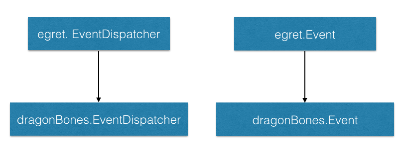
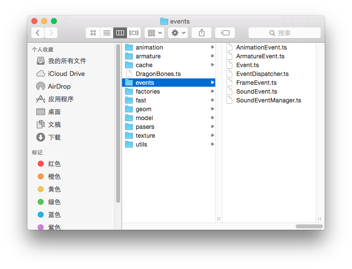
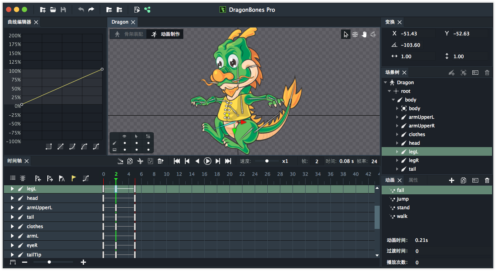
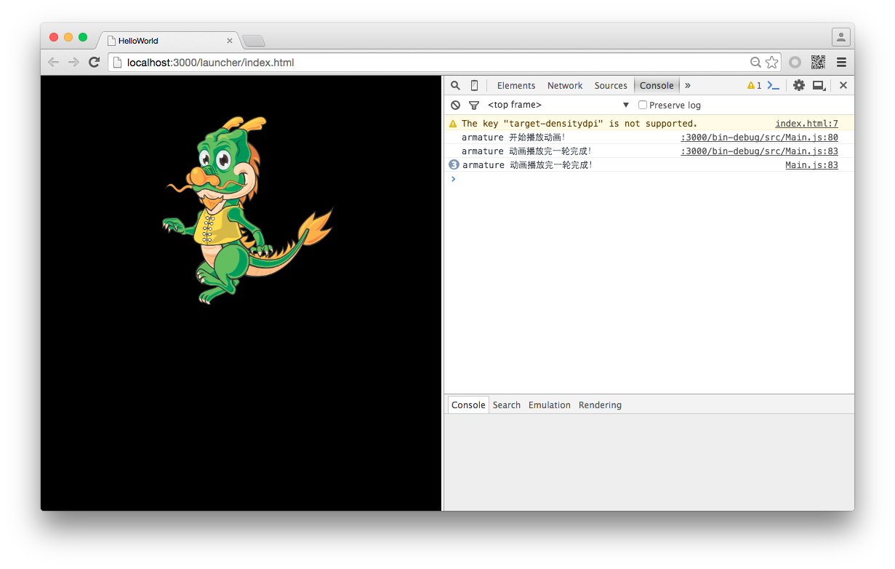
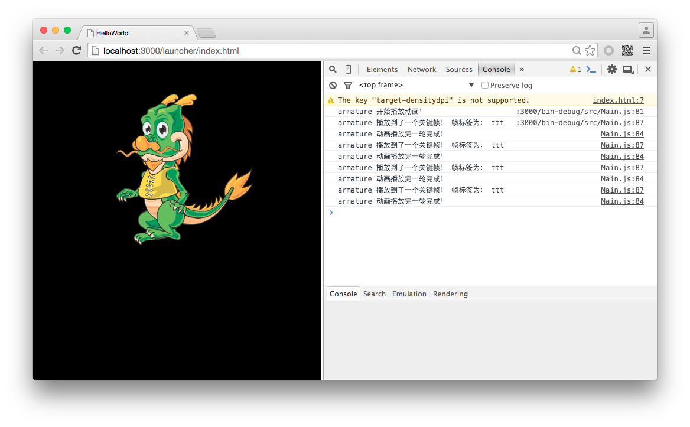
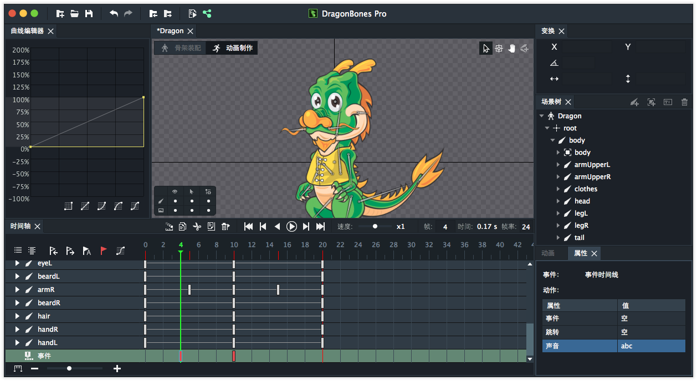
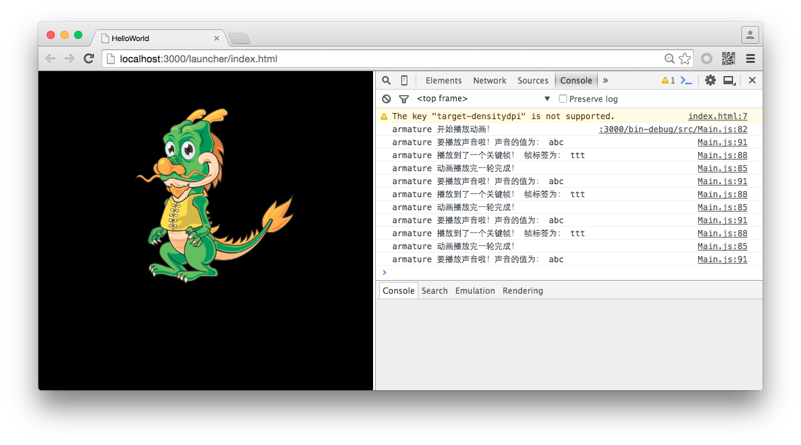

当你的程序修改了某种状态时，我们希望能够得到系统的通知，并告知我们，那些状态被修改了，同时得到一些相关信息。在Egret 中，负责消息派发的根类被命名为 `egret.EventDispatcher` 。每一次传递的消息，我们也可以称之为系统给我们派发了一个 `Message`，而这个消息的内容，我们将其封装为 `egret.Event`。这个机制很美好，因为当没有任何东西被改变的时候，我们也不希望做一些无用的操作。

上面的机制在Egret中被完整的实现了，而在DragonBones中，这个机制依然可以正常运行，但稍稍有些不同。

我建议你一遍阅读这边文章，一遍翻看DragonBones的源码，在DragonBones中，存在这一个名为 `dragonBones.Event` 的类，如果你查阅它的继承关系，你会发现，它直接继承自 `egret.Event`，同时没有做任何扩展操作。我们可以直接让 `dragonBones.Event` 从这个世界上消失，但这样会导致很多游戏中的骨骼动画无法正常运行，为了兼容，我们妥协了。

DragonBones中也有能够派发事件的类，`dragonBones.EventDispatcher` 这个类直接继承自 `egret.EventDispatcher` 。所以，你现在能够明白，为什么 DragonBones 能够拥有和 Egret 统一的事件机制。他们的关系如下图：



OK，现在我们可以开心的使用DraonBones的事件系统了，接下来要搞明白的是，DragonBones到底会派发什么样的事件给我们，我们能得到哪些变化的通知。

在DragonBones源码目录中，你可以查看到一个名为 `events` 的文件夹，如图：



我们所有能用的事件都存放在这个文件夹中。

通过命名，你可以看出这些事件对应的是哪些类型的事件，例如 `AnimationEvent.ts` ，定义了骨骼动画中相关状态的事件类型。`ArmatureEvent.ts` 中定义了骨架相关事件类型。你可以通过[Egret API](http://edn.egret.com/cn/apidoc/index/name/dragonBones.AnimationEvent)手册来获取这些事件的细节信息。

## DragonBones中系统事件的使用方法

使用DragonBones Pro默认的项目，导出一个动画数据。



创建空白项目，并编写代码：

```
class Main extends egret.DisplayObjectContainer {

    public constructor() {
        super();
        this.addEventListener(egret.Event.ADDED_TO_STAGE, this.onAddToStage, this);
    }

    private onAddToStage(event:egret.Event) {
        //初始化Resource资源加载库
        //initiate Resource loading library
        RES.addEventListener(RES.ResourceEvent.CONFIG_COMPLETE, this.onConfigComplete, this);
        RES.loadConfig("resource/resource.json", "resource/");
    }

    /**
     * 配置文件加载完成,开始预加载preload资源组。
     * configuration file loading is completed, start to pre-load the preload resource group
     */
    private onConfigComplete(event:RES.ResourceEvent):void {
        RES.removeEventListener(RES.ResourceEvent.CONFIG_COMPLETE, this.onConfigComplete, this);
        RES.addEventListener(RES.ResourceEvent.GROUP_COMPLETE, this.onResourceLoadComplete, this);
        RES.addEventListener(RES.ResourceEvent.GROUP_LOAD_ERROR, this.onResourceLoadError, this);
        RES.addEventListener(RES.ResourceEvent.GROUP_PROGRESS, this.onResourceProgress, this);
        RES.loadGroup("preload");
    }

    /**
     * preload资源组加载完成
     * Preload resource group is loaded
     */
    private onResourceLoadComplete(event:RES.ResourceEvent):void {
        if (event.groupName == "preload") {
            RES.removeEventListener(RES.ResourceEvent.GROUP_COMPLETE, this.onResourceLoadComplete, this);
            RES.removeEventListener(RES.ResourceEvent.GROUP_LOAD_ERROR, this.onResourceLoadError, this);
            RES.removeEventListener(RES.ResourceEvent.GROUP_PROGRESS, this.onResourceProgress, this);
            this.createGameScene();
        }
    }

    /**
     * 资源组加载出错
     *  The resource group loading failed
     */
    private onResourceLoadError(event:RES.ResourceEvent):void {
        //TODO
        console.warn("Group:" + event.groupName + " has failed to load");
        //忽略加载失败的项目
        //Ignore the loading failed projects
        this.onResourceLoadComplete(event);
    }

    /**
     * preload资源组加载进度
     * Loading process of preload resource group
     */
    private onResourceProgress(event:RES.ResourceEvent):void {
        
    }

    private textfield:egret.TextField;

    /**
     * 创建游戏场景
     * Create a game scene
     */
    private createGameScene():void {
        var dragonbonesData = RES.getRes( "Dragon_json" );  
        var textureData = RES.getRes( "texture_json" );  
        var texture = RES.getRes( "texture_png" );

        var dragonbonesFactory:dragonBones.EgretFactory = new dragonBones.EgretFactory();  
        dragonbonesFactory.addDragonBonesData(dragonBones.DataParser.parseDragonBonesData(dragonbonesData));  
        dragonbonesFactory.addTextureAtlas(new dragonBones.EgretTextureAtlas(texture,textureData));

        var armature: dragonBones.Armature = dragonbonesFactory.buildArmature("Dragon");

        this.addChild(armature.display);
        armature.display.x = 200;
        armature.display.y = 300;
        armature.display.scaleX = 0.5;
        armature.display.scaleY = 0.5;
        dragonBones.WorldClock.clock.add( armature );  

        egret.startTicker(  
          function(frameTime:number){dragonBones.WorldClock.clock.advanceTime(0.02)},  
            this );

        armature.addEventListener( dragonBones.AnimationEvent.START, this.startPlay,this);
        armature.addEventListener( dragonBones.AnimationEvent.LOOP_COMPLETE, this.loop_com,this);

        armature.animation.gotoAndPlay("walk");
    }

    private startPlay(evt:dragonBones.ArmatureEvent)
    {
        console.log( "armature 开始播放动画！");
    }
    private loop_com(evt:dragonBones.ArmatureEvent)
    {
        console.log( "armature 动画播放完一轮完成！");
    }
}

```

编译并运行，你应该在控制台看到如下输出：



需要特殊说明的是，在 `dragonBones.AnimationEvent` 这个事件类型中包含 `COMPLETE` 和 `LOOP_COMPLETE` 两种完成动画播放事件类型，两种事件类型使用最为常用，但稍有区别。

* COMPLETE：当前动作播放到最后一帧，播放完成后则停止动画，或者跳转到其他动画时，派发此事件。
* LOOP_COMPLETE：当前动画进行循环播放，当播放到最后一帧时，派发此事件。

在DragonBones中，你能看到的事件，除了`dragonBones.SoundEvent`以外，其他事件都是由 `dragonBones.Armature` 对象派发的。

## 高大上的用户自定义事件

这个需求来源于我们对动画使用的场景，当一个人物动画播放“射击”动画时，我们希望在某一个关键帧能够派发一个自定义事件，来通知游戏业务逻辑执行射击操作。而在DragonBones中我们已经为你准备好了这一切。

在下面的截图中，我们寻找到时间轴最后一层的事件层，然后在第10帧添加关键帧，打开属性面板，在”事件“一栏的”值中设置自定义字符串，其值为 `ttt` (请允许我的命名不严谨，因为者仅仅是个演示）。


重新导出数据，并修改代码如下：

```
/**
 * 创建游戏场景 省略上面加载资源的代码，可以在默认项目中获取到。
 * Create a game scene
 */
private createGameScene():void {
    var dragonbonesData = RES.getRes( "Dragon_json" );  
    var textureData = RES.getRes( "texture_json" );  
    var texture = RES.getRes( "texture_png" );

    var dragonbonesFactory:dragonBones.EgretFactory = new dragonBones.EgretFactory();  
    dragonbonesFactory.addDragonBonesData(dragonBones.DataParser.parseDragonBonesData(dragonbonesData));  
    dragonbonesFactory.addTextureAtlas(new dragonBones.EgretTextureAtlas(texture,textureData));

    var armature: dragonBones.Armature = dragonbonesFactory.buildArmature("Dragon");

    this.addChild(armature.display);
    armature.display.x = 200;
    armature.display.y = 300;
    armature.display.scaleX = 0.5;
    armature.display.scaleY = 0.5;
    dragonBones.WorldClock.clock.add( armature );  

    egret.startTicker(  
      function(frameTime:number){dragonBones.WorldClock.clock.advanceTime(0.02)},  
        this );

    armature.addEventListener( dragonBones.AnimationEvent.START, this.startPlay,this);
    armature.addEventListener( dragonBones.AnimationEvent.LOOP_COMPLETE, this.loop_com,this);
    armature.addEventListener( dragonBones.FrameEvent.ANIMATION_FRAME_EVENT, this.frame_event,this);

    armature.animation.gotoAndPlay("walk");
}

private startPlay(evt:dragonBones.ArmatureEvent)
{
    console.log( "armature 开始播放动画！");
}
private loop_com(evt:dragonBones.ArmatureEvent)
{
    console.log( "armature 动画播放完一轮完成！");
}
private frame_event(evt:dragonBones.FrameEvent)
{
    console.log( "armature 播放到了一个关键帧！ 帧标签为：",evt.frameLabel);
}
```

编译并运行，截图如下：



我们可以看到，当动画播放到第10帧时，会派发 dragonBones.FrameEvent.ANIMATION_FRAME_EVENT事件，在事件的响应函数中，可以得到frameLabel属性，该属性就是我们在 DragonBones Pro中填写的“值”。

好了，你可能注意到，事件关键帧的属性面板中不仅仅包含“事件”，还包含“跳转”和“声音”。如果你使用了跳转，那么值的内容应该为另外一个动画的名称。如果你使用了“声音”，那么我们要好好聊一聊了。

现在我们在第4帧添加一个新的事件关键帧，并在“声音”中设置值为abc，如图：



导出新数据，并修改代码如下：

```
/**
 * 创建游戏场景 省略上面加载资源的代码，可以在默认项目中获取到。
 * Create a game scene
 */
private createGameScene():void {
    var dragonbonesData = RES.getRes( "Dragon_json" );  
    var textureData = RES.getRes( "texture_json" );  
    var texture = RES.getRes( "texture_png" );

    var dragonbonesFactory:dragonBones.EgretFactory = new dragonBones.EgretFactory();  
    dragonbonesFactory.addDragonBonesData(dragonBones.DataParser.parseDragonBonesData(dragonbonesData));  
    dragonbonesFactory.addTextureAtlas(new dragonBones.EgretTextureAtlas(texture,textureData));

    var armature: dragonBones.Armature = dragonbonesFactory.buildArmature("Dragon");

    this.addChild(armature.display);
    armature.display.x = 200;
    armature.display.y = 300;
    armature.display.scaleX = 0.5;
    armature.display.scaleY = 0.5;
    dragonBones.WorldClock.clock.add( armature );  

    egret.startTicker(  
      function(frameTime:number){dragonBones.WorldClock.clock.advanceTime(0.02)},  
        this );

    armature.addEventListener( dragonBones.AnimationEvent.START, this.startPlay,this);
    armature.addEventListener( dragonBones.AnimationEvent.LOOP_COMPLETE, this.loop_com,this);
    armature.addEventListener( dragonBones.FrameEvent.ANIMATION_FRAME_EVENT, this.frame_event,this);
    dragonBones.SoundEventManager.getInstance().addEventListener( dragonBones.SoundEvent.SOUND, this.sound_event,this);

    armature.animation.gotoAndPlay("walk");
}

private startPlay(evt:dragonBones.ArmatureEvent)
{
    console.log( "armature 开始播放动画！");
}
private loop_com(evt:dragonBones.ArmatureEvent)
{
    console.log( "armature 动画播放完一轮完成！");
}
private frame_event(evt:dragonBones.FrameEvent)
{
    console.log( "armature 播放到了一个关键帧！ 帧标签为：",evt.frameLabel);
}
private sound_event(evt:dragonBones.SoundEvent)
{
    console.log( "armature 要播放声音啦！声音的值为：",evt.sound);
}

```

编译并运行，你应该看到如下图效果：



值得注意的一点（其实前面也说过了），`dragonBones.SoundEvent.SOUND`事件由 `dragonBones.SoundEventManager.getInstance()` 这个单例对象来派发，并非 `dragonBones.Armature` 对象。你需要特别注意这一点！！！！

我想你在读完这篇文章后，能够明白DragonBones为你准备的系统事件和自定义事件是如何使用的，现在开心的做你的游戏吧！！