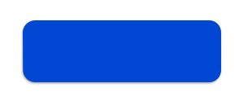
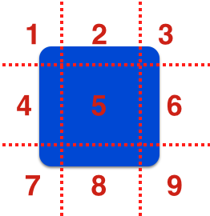

## 使用
通常情况下为了游戏画面中的美观程度，会使用一些圆角矩形或者边缘不规则的矩形。 在游戏中，经常会对这些图形进行拉伸，那么拉伸后的图形会发生变形。为了让边缘不会因为拉伸而变形，可以使用“九宫格”。

下图是一个圆角矩形


将这个圆角矩形横向拉伸，边缘的拉伸变化如下图：


上面的效果不符合要求，会影响美观。希望无论图片如何拉伸，圆角始终不会变形，如下图。



九宫格系统可以实现上述效果。



上图中，用四条虚线将圆角矩形分割为9个区域，其中四个区域(图中区域编号1，3，7，9)包含了圆角矩形的四个圆角。拉伸图像时，1，3，7，9区域不拉伸，2，8区域仅横向拉伸，4，6区域仅纵向拉伸，5区域横向纵向都拉伸。

设置九宫格的属性是 `Bitmap` 类中的 `scale9Grid` 属性。

下面是一个完整的示例代码，这个示例中，放置两个 `Bitmap` 对象，两个 `Bitmap` 对象都将 width 设置为原来的2倍。其中一个添加九宫格数据，另外一个不添加九宫格数据。

```
class BitmapTest extends egret.DisplayObjectContainer{
    public constructor() {
        super();
        this.addEventListener(egret.Event.ADDED_TO_STAGE,this.onAddToStage,this);
    }
    
    private onAddToStage(event:egret.Event) {
        RES.addEventListener(RES.ResourceEvent.GROUP_COMPLETE, this.onGroupComp, this);
        RES.loadConfig("resource/resource.json", "resource/");
        RES.loadGroup("preload");
    }
    private onGroupComp() {
        var img:egret.Bitmap = new egret.Bitmap();
        img.texture = RES.getRes("box");
        img.width *= 2;
        this.addChild(img);
        var img2:egret.Bitmap = new egret.Bitmap();
        img2.texture = RES.getRes("box");
        var rect:egret.Rectangle = new egret.Rectangle(30,31,40,41);
        img2.scale9Grid =rect;
        img2.width *= 2;
        img2.y = 150;
        this.addChild(img2);
    }
}
```

上面的代码中，创建了一个类型为 `Rectangle` 的对象。该对象用来存放九宫格数据。初始化时填入了四个参数。

* 30：区域1 的宽度值。

* 31：区域1 的高度值

* 40：区域2 的宽度值

* 41：区域4 的高度值

> 注意：设置九宫宽高的时候尽量使用整数，否则有些浏览器可能会出现“黑线”。

关于九宫格的更多示例，可以参考[教学示例](http://developer.egret.com/cn/example/egret2d/index.html#050-bitmap-prac-9grid)

## 错误处理

在正常情况下，九宫格区域的宽度和高度要小于图片的宽度和高度，位置在图片内部。如果设置的九宫格位置或者宽度和高度异常的情况下会报如下错误：

```
Warning #1018: 9宫格设置错误
```

具体来讲正确的九宫格设置为:
```
x + w < 图片宽度;
y + h < 图片高度;
```
其中`x`和`y`是设置九宫格的位置，w和h为设置九宫格的宽和高。其中 x,y,w,h 应大于等于 0。

> 在 Egret 3.0.3 之前的版本中 x,y,w,h 是不能设置为 0 的。
