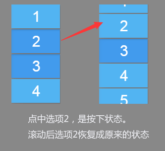

### 1.触摸事件
对于移动游戏，触摸事件是最常用的用户交互事件类型。Egret 为触摸事件设置了专门的触摸事件类`egret.TouchEvent`。

其包含的事件类型主要有：
* TOUCH_BEGIN：当用户第一次触摸启用触摸的设备时（例如，用手指触摸配有触摸屏的移动电话或平板电脑）触发
* TOUCH_CANCEL：由于某个事件取消了触摸时触发
* TOUCH_END：当用户移除与启用触摸的设备的接触时（例如，将手指从配有触摸屏的移动电话或平板电脑上抬起）触发
* TOUCH_MOVE：当用户触碰设备并移动时进行触发，而且会连续触发，直到接触点被删除
* TOUCH_TAP：当用户在触摸设备上与开始触摸的同一 DisplayObject 实例上抬起接触点时触发（相当与点击事件）

在Egret中使用触摸事件时，需要打开显示对象的触摸事件开关，即将该显示对象的`touchEnabled`属性设置为`true`。代码示例如下：

```
class TouchEventTest extends egret.DisplayObjectContainer
{
    public constructor()
    {
        super();
        this.addEventListener(egret.Event.ADDED_TO_STAGE,this.onAddToStage,this);
    }
    private onAddToStage(event:egret.Event)
    {
        //添加显示文本
        this.drawText();
        //绘制一个透明度为1的绿色矩形，宽高为100*80
        var spr1:egret.Sprite = new egret.Sprite();
        spr1.graphics.beginFill(0x00ff00, 1);
        spr1.graphics.drawRect(0, 0, 100, 80);
        spr1.graphics.endFill();
        spr1.width = 100;
        spr1.height = 80;
        this.addChild( spr1 );
		//设置显示对象可以相应触摸事件
		spr1.touchEnabled = true;
        //注册事件
        spr1.addEventListener( egret.TouchEvent.TOUCH_TAP, this.onTouch, this );
        this.addEventListener(egret.TouchEvent.TOUCH_TAP, this.onTouchTap, this);
        this.addEventListener(egret.TouchEvent.TOUCH_TAP, this.onTouchTaps, this, true);
    }
    private onTouch( evt:egret.TouchEvent )
    {
        this.txt.text += "\n点击了spr1";
    }
    private onTouchTap( evt:egret.TouchEvent )
    {
        this.txt.text += "\n容器冒泡侦听\n---------";
    }
    private onTouchTaps( evt:egret.TouchEvent )
    {
        this.txt.text += "\n容器捕获侦听";
    }
    //绘制文本
    private  txt:egret.TextField;
    private drawText():void
    {
        this.txt = new egret.TextField();
        this.txt.size = 12;
        this.txt.x = 250;
        this.txt.width = 200;
        this.txt.height = 200;
        this.txt.text = "事件文字";
        this.addChild( this.txt );
    }
}
```

### 2.取消触摸事件

取消触摸事件，在由于某个事件 取消了触摸 时触发。

以点击事件为例，一个点击的流程一般会触发3个 touch 事件：`TouchBegin` 触摸开始，`TouchEnd` 触摸结束，`TouchTap` 点击。

在某些特殊情况，比如 EUI 中的 `Scroller` 滚动列表，当手指点中它后，首先抛出一个 `TouchBegin`，如果此时没有滚动，直接离开屏幕，那么还是原来标准的流程，抛出 `TouchEnd` 和 `TouchTap`。但是当手指滚动它以后，则会抛出一个 `TouchCancel` 事件，而后续的 `TouchEnd` 和 `TouchTap` 事件就不会被触发了。

下面是一个示例代码，创建一个滚动列表并增加监听

~~~
var scroller = new eui.Scroller();
var list = new eui.List();  
list.itemRendererSkinName = `
        <e:Skin states="up,down,disabled" minHeight="50" minWidth="100" xmlns:e="http://ns.egret.com/eui"> <e:Image width="100%" height="100%" scale9Grid="1,3,8,8" alpha.disabled="0.5"
                     source="resource/button_up.png"
                     source.down="resource/button_down.png"/> <e:Label text="{data}" top="8" bottom="8" left="8" right="8"
                     textColor="0xFFFFFF" verticalAlign="middle" textAlign="center"/> </e:Skin>`
var ac = new eui.ArrayCollection([1, 2, 3, 4, 5, 6, 7, 8, 9, 10, 11, 12, 13, 14, 15, 16]);
list.dataProvider = ac;
scroller.viewport = list;
scroller.height = 200;
this.addChild(scroller);

scroller.addEventListener(egret.TouchEvent.TOUCH_BEGIN,()=>{console.log("111 Scroller Begin")},this);
list.addEventListener(egret.TouchEvent.TOUCH_BEGIN,()=>{console.log("111 List Begin")},this);

scroller.addEventListener(egret.TouchEvent.TOUCH_END,()=>{console.log("222 Scroller END")},this);
list.addEventListener(egret.TouchEvent.TOUCH_END,()=>{console.log("222 List END")},this);

scroller.addEventListener(egret.TouchEvent.TOUCH_TAP,()=>{console.log("33 Scroller Tap")},this);
list.addEventListener(egret.TouchEvent.TOUCH_TAP,()=>{console.log("33 List Tap")},this);

scroller.addEventListener(egret.TouchEvent.TOUCH_CANCEL,()=>{console.log("44 Scroller cancel")},this);
list.addEventListener(egret.TouchEvent.TOUCH_CANCEL,()=>{console.log("44 List cancel")},this);
~~~


当没有滚动，点击列表后，会依次抛出以下事件。

~~~
111 List Begin
111 Scroller Begin
222 List END
222 Scroller END
33 List Tap
33 Scroller Tap
~~~


上图为点击后的样子

当滚动 `scroller` 以后，会抛出 `TouchCancel`，后续的 touch 事件不会被触发。

~~~
111 List Begin
111 Scroller Begin
44 List cancel
44 Scroller cancel
~~~



另外 `TouchCancel` 触发以后，说明触摸被取消了，本次触摸被选中的选项条也会恢复成选中前的状态。