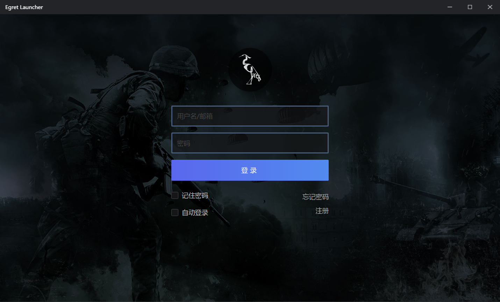
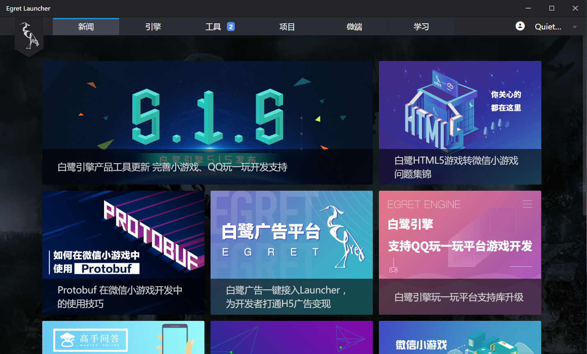
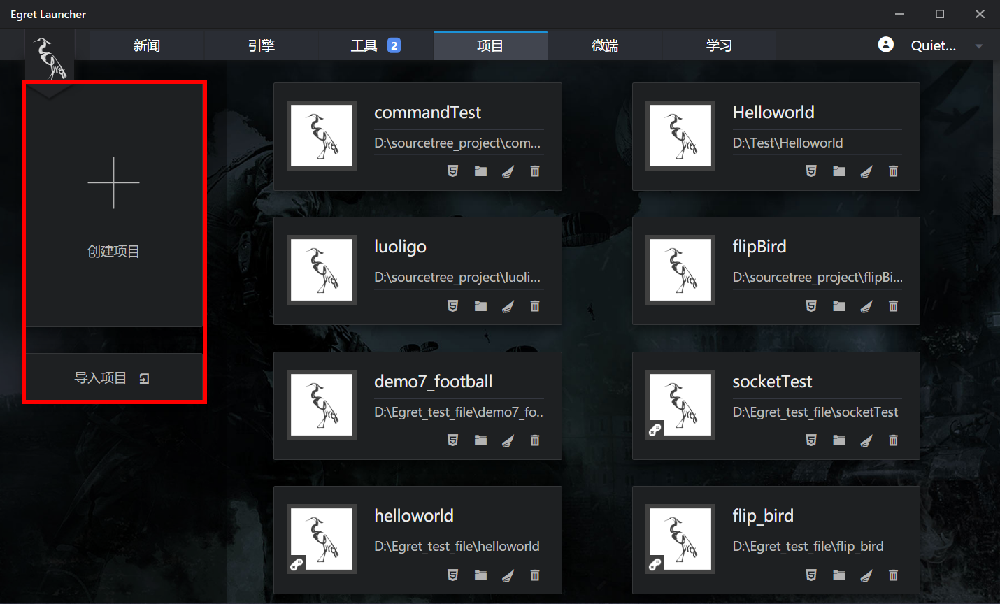
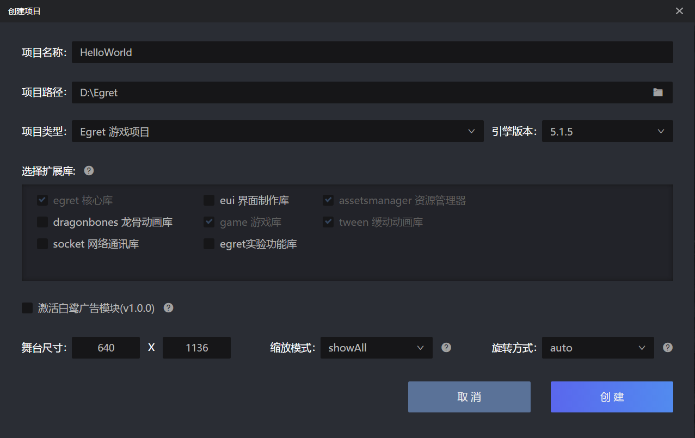
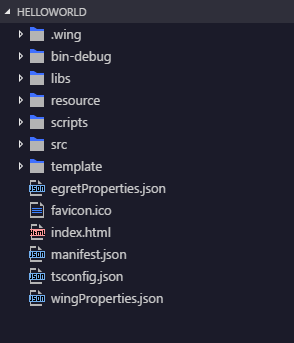

### 安装引擎

下载[Egret Engine](http://www.egret.com/products/engine.html),（可参考：[安装与部署](../../../Engine2D/projectConfig/installation/README.md)）。

### 安装开发工具

打开 Egret Launcher，会显示登录界面，如下图。

登陆成功后会显示 Egret Launcher 主界面。

### 创建项目

1、点击菜单 `项目` -> `创建项目` 来创建项目，如下图。

也可以选择 `导入项目` 来导入已有项目。

2、在弹出的新建项目面板中，设置项目的基本配置，如下图。

* 项目名称 
当前项目的名称，如 HelloWorld。

* 项目路径
该项目所存放的文件路径。

* 项目类型
该项目的项目类型，如 Egret 游戏项目 ， Egret EUI 项目。

* 引擎版本
  当前项目所使用的 Egret 的版本。

* 选择扩展库
项目中需要使用的系统库。更多关于扩展库选择的介绍可以参考：[扩展库简介](../../../Engine2D/projectConfig/extendRepSummary/README.md)

* 舞台尺寸
 默认游戏舞台的高度与宽度，以像素为单位.

* 缩放模式
  屏幕的适配方式，这里选择showALL模式。更多关于缩放模式的介绍可以参考：[屏幕适配](../../../Engine2D/screenAdaptation/screenAdaptation/README.md)
	
* 旋转方式
	屏幕的旋转模式，这里选择auto模式。更多关于旋转设置的介绍可以参考：[屏幕适配](../../../Engine2D/screenAdaptation/screenAdaptation/README.md)

点击 `创建` ，创建Hello World项目。

项目可以直接在Egret Launcher 中进行打开，管理。

### 项目结构

在Egret Wing左侧，可看到当前项目的目录结构：

各文件夹功能说明
* .wing：包括 Egret 项目的任务配置文件和启动配置文件。
* bin-debug：项目调试时，所产生的文件存放于此目录。
* libs：库文件，包括 Egret 核心库和其他扩展库存放于此目录。
* resource：项目资源文件存放于此目录。
* script：项目构建和发布时需要用到的脚本文件存放在此目录。
* src：项目代码文件存放于此目录。
* template：项目模板文件存放于此目录。
* egretProperties.json：项目的配置文件。具体的配置说明可以参考：[EgretProperties说明](../../../Engine2D/projectConfig/configFile/README.md)
* index.html：入口文件。具体的配置说明可以参考：[入口文件说明](../../../Engine2D/projectConfig/indexFile/README.md)
* manifest.json：清单文件。
* tsconfig.json：typescript 编译配置文件。
* wingProperties.json：Egret Wing 项目配置文件。

### 运行项目

点击菜单“项目”->“构建”，编译项目，如下图。

构建完成之后点击菜单“项目”->“调试”，运行项目，如下图。

