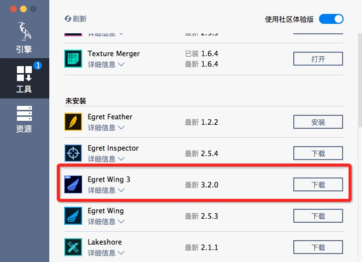
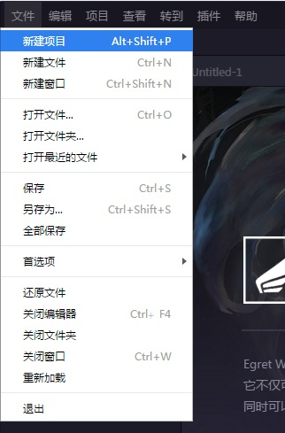
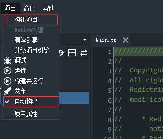

相信大家都是从打印一行 Hellow World 开始来学习的。下面就从创建一个默认的 HelloWorld 项目开始。

### 准备工作

#### 引擎与工具

首先当然是获得 Egret Engine 了。可以在官网[下载](http://www.egret.com/products/engine.html)。安装过程很简单。如果需要的话可以参考具：[安装与部署](../../../Engine2D/projectConfig/installation/)和[引擎和工具的管理](../../../Engine2D/projectConfig/launcherManager/)。安装好后以后我们可以方便的管理 Egret 引擎和工具了。

打开引擎管理工具，可以看到有工具选项卡，可以在这里找到 Egret Wing。Egret Wing 是针对 Egret 项目的 IDE。下面的教程都以 Egret Wing 来做演示。



新用户可能还没有安装 Egret Wing,上图打开部分显示为安装，点击即可。

这里需要注意的是我们安装的是最新版的 Egret Wing，需要打开右上角的社区体验版按钮。

Egret 也支持在命令行完成编译，运行，发布等操作。在下面的教程中会穿插对应操作的命令行代码。

#### TypeScript

Egret 项目使用 TypeScirpt 语言来开发。TypeScript 是 JavaScript 的超集，具体内容可以参考[TyptScript语言手册](http://bbs.egret.com/thread-1441-1-1.html)。在下的教程中会一点一点讲解具体的语法与使用规则。Egret 的 API 和 AS3 有很多相似之处，如果您熟悉的话肯定容易上手。 

### 创建空项目

当大家熟悉 Egret 开发之后可以直接创建Egret游戏项目或者Egret EUI 项目等，里面包含了很多默认的配置。现在学习 Egret 第一步还是从一个完全空的项目来开始。

#### 使用 Egret Wing 创建项目

安装好Egret Wing 之后，打开 Wing 可以看到欢迎界面。在欢迎界面上面可以快速创建项目。



这里我们需要的是创建新的项目。当然也可以在文件菜单下的新建项目来创建我们的新项目。

选择建新项目之后会弹出新建项目的面板，在这里需要选择项目的基本配置。


这里我们从一个游戏项目开始。游戏项目将会包含一套 HelloWorld 的模板，并包含我们常用的库几个库，`game`,`tween`,`res`。 选择其他项目将会创建包含相应项目模板的项目，比如，EUI项目将会包含EUI项目模板。 项目下面需要填写项目的名称和路径，这里大家应该都不陌生，项目名称是必填的字段，填写完成好后才能点击下一步。

这里填入项目的名称 `HelloWorld` ,目录选择我的常用目录,当然也可以自定义。

点击下一步会弹出项目属性设置面板：


这里可以设置舞台的宽度和高度，这里的舞台是我们呈现游戏的地方。当我们的项目运行在不同的平台上面比如桌面浏览器和手机浏览器上面时，设备本身的宽度和高度是不同的。这时就需要缩放舞台来达到更好的用户体验。舞台的宽和高在选择不同的缩放模式下会有不同的展现方式，如图例所示，在该模式下舞台会保持宽高比，当我们设计好舞台的尺寸之后会保持它的宽高比，当设备的窗口不同的时候，缩放后应用程序内容向较宽方向填满播放器窗口，另一个方向的两侧可能会不够宽而留有黑边。在此模式下，舞台尺(stage.stageWidth,stage.stageHeight)始终等于初始化时外部传入的应用程序内容尺寸。

而当我们的游戏运行在移动端的时候，会面临屏幕旋转的问题。这里我们旋转`AUTO`选项，舞台将随设备旋转而旋转。

这里还可以选择舞台的背景颜色，可以根据项目的具体需要设定。如果舞台是空的情况下就会只显示该颜色。

更多关于旋转和缩放模式的介绍可以参考：[缩放模式和旋转模式说明](../../../Engine2D/screenAdaptation/explanation/)

当然这些设置都是可以更改的，下面将进一步介绍。

#### 使用命令行创建项目

可以使用

```
egret create HelloWorld
```

来创建我们上面的是默认的游戏项目，如果有特殊需要可以加入参数`--type empty|game|gui|eui`来指定不同的项目。

如果需要设置项目的旋转和缩放模式，需要在项目内来修改，在下面会介绍。


### 项目结构

选择好舞台的设置之后点击下一步，我们的项目就创建好了。在 Wing 的左上角可以看到有我们项目的目录结构：


* Fighter 我们的项目名称
* * src 目录，存放我们的代码。我们编写的代码都放在src目录下面。
* * bin-debug 目录，项目编译和运行的debug目录，一般我们不要修改该目录下的内容。
* * libs 目录，这里面存放我们的库文件，包括 Egret 核心库和其他扩展库。当然以后添加了第三方库的话也会放在这里。
* * resource 目录，这里放置我们的资源文件，这里面有一个`default.res.json` 配置文件，用来配置资源。
* * template 目录，这里是项目调试过程中所需的目录，一般我们不需要修改该目录下的内容。
* * egretProperties.json 项目的配置文件，一般我们会用到里面的`modules` 字段来配置项目的模块。
* * index.html 项目访问的入口文件，我们可以在这里面配置项目的旋转缩放模式背景颜色等。
* * favicon.ico 一个ico。

#### index.html

在 index.html 文件里可以完成很多配置。打开文件，在第15行可以看到：

```
background: #888888;
```

这里可以设置舞台的背景颜色。

在第29行到第31行可以看到：

```
<!--这个标签为不通过egret提供的第三方库的方式使用的 javascript 文件，请将这些文件放在libs下，但不要放在modules下面。--> <!--other_libs_files_start--> <!--other_libs_files_end-->```  

这里是添加自定义的第三方库文件的引用，需要放置在`<!--other_libs_files_start-->`和`<!--other_libs_files_end-->`之间。一般情况下这种第三方库是包含 `.js` 和 `.d.ts` 文件,不要包含`.ts`文件。 

在第40到第52行可以看到:
```
    <div style="margin: auto;width: 100%;height: 100%;" class="egret-player"
         data-entry-class="Main"
         data-orientation="auto"
         data-scale-mode="showAll"
         data-resolution-mode="retina"
         data-frame-rate="30"
         data-content-width="480"
         data-content-height="800"
         data-show-paint-rect="false"
         data-multi-fingered="2"
         data-show-fps="false" data-show-log="false"
         data-log-filter="" data-show-fps-style="x:0,y:0,size:30,textColor:0x00c200,bgAlpha:0.9"> </div>```    

在这里可以配置项目的很多设置：

* data-entry-class="Main" 设置项目的入口文件，表示项目的入口类，默认为`Main`,如果需要自定义的话需要在项目中先创建类，然后在这里配置类的名字。
* data-orientation="auto" 设置旋转模式。
* data-scale-mode="showAll" 设置缩放模式。
* data-frame-rate="30" 这里是运行的帧率。
* data-content-width="480" 和 data-content-height="800" 用来设置舞台的设计宽和高
* data-show-paint-rect="false" 设置显示脏矩形的重绘区域。
* data-multi-fingered="2" 设置多指触摸
* data-show-fps="false" data-show-log="false" 这里设置显示帧率和log，只有在调试时会显示，发布的版本会去掉。
* data-log-filter=""  设置一个正则表达式过滤条件，日志文本匹配这个正则表达式的时候才显示这条日志。如 `data-log-filter="^egret"` 表示仅显示以 `egret` 开头的日志。
* data-show-fps-style="x:0,y:0,size:30,textColor:0x00c200,bgAlpha:0.9" 这里设置fps面板的样式。目前支持默认的这几种设置，修改其值即可，比如修改面板位置可以设置`x`和`y`,改变大小可以设置`size`,改变文字颜色`textColor`，改变背景面板的透明度`bgAlpha`。

> 不要随意修改其他代码，包括其中的注释。

#### egretProperties.json

这个文件里面进行项目配置,包括模块和第三方库的配置，发布和native相关配置。

我们比较常用的设置就是添加模块和第三方库。

具体的配置说明可以参考：[EgretProperties说明](../../../Engine2D/projectConfig/configFile/)

### 调试项目

#### 编写第一行代码

项目的入口类默认在`src/Main.ts`里面，在上面创建的项目里面默认包含下面代码：

```
class Main extends egret.DisplayObjectContainer 
```
第一行我们看到 `class` 关键字，表示类。如果熟悉面向对象编程的开发者肯定熟悉。表示我们声明一个类，而类名就是 `Main`,我们的入口类。这个是我们可以自己定义的。如果修改之后需要在上面的 `index.html` 里面修改。下一个关键字 `extends` 表示该类继承自什么地方。Egret Engine 规定入口的文档类必须继承自显示容器`DisplayObjectContainer`或其子类。关于显示对象的具体知识下面会讲到。

下面编写我们的项目的第一行代码,在默认的代码中找到第 119 行，`createGameScene()`函数里面下面一行添加`console.log("Hello World");`。变成了下面的样子：

```
private createGameScene():void {
        
        console.log("Hello World");
        
        var sky:egret.Bitmap = this.createBitmapByName("bgImage");
        this.addChild(sky);
        var stageW:number = this.stage.stageWidth;
        var stageH:number = this.stage.stageHeight;
        sky.width = stageW;
        sky.height = stageH;

        var topMask:egret.Shape = new egret.Shape();
        topMask.graphics.beginFill(0x000000, 0.5);
        topMask.graphics.drawRect(0, 0, stageW, stageH);
        topMask.graphics.endFill();
        topMask.width = stageW;
        topMask.height = stageH;
        this.addChild(topMask);

        var icon:egret.Bitmap = this.createBitmapByName("egretIcon");
        this.addChild(icon);
        icon.scaleX = 0.55;
        icon.scaleY = 0.55;
        icon.anchorOffsetX = icon.width / 2;
        icon.anchorOffsetY = icon.height / 2;
        icon.x = stageW / 2;
        icon.y = stageH / 2 - 60;

        var colorLabel:egret.TextField = new egret.TextField();
        colorLabel.textColor = 0xffffff;
        colorLabel.textAlign = "center";
        colorLabel.text = "Hello Egret";
        colorLabel.size = 20;
        colorLabel.x = stageW - colorLabel.width >> 1;
        colorLabel.y = (stageH - colorLabel.height >> 1) + 50;
        this.addChild(colorLabel);

        var textfield:egret.TextField = new egret.TextField();
        this.addChild(textfield);
        textfield.alpha = 0;
        textfield.width = stageW;
        textfield.textAlign = egret.HorizontalAlign.CENTER;
        textfield.x = 0;
        textfield.y = stageH / 2 + 100;
        this.textfield = textfield;

        //根据name关键字，异步获取一个json配置文件，name属性请参考resources/resource.json配置文件的内容。
        // Get asynchronously a json configuration file according to name keyword. As for the property of name please refer to the configuration file of resources/resource.json.
        RES.getResAsync("description", this.startAnimation, this)
    }
```
这里我们调用了一条常用的调试命令，`console.log("需要显示的log内容")`将在浏览器的开发者工具下显示出来我们的log。我们推荐使用 Chrome 来调试 Egret 项目。

#### 调试项目

编写好代码后需要构建项目才会生效，把`TypeScript`代码编译成`JavaScript`代码，这样是使用`TypeScipt`的一大特性。Wing 里面默认是开启自动构建的，即按快捷键`Ctrl + s` 即可自动构建项目。如果需要关闭自动构建的话可以在项目里面把自动构建的勾去掉，然后手动点击构建项目按钮。



用命令行的情况下，使用下面代码可以构建项目：
```
egret build
```
构建完成之后点击调试按钮将自动打开浏览器,打开浏览器之后可以打开发者工具(Chrome 默认快捷键为F12)，即可看到我们上面的log输出出来了。


也可以使用命令行来运行项目：

```
egret startserver
```

当我们修改代码后只需刷新页面即可看到效果。
到目前为止我们程序还没有什么实际功能，只是打印出来一行字符。下面将慢慢深化我们的程序。
