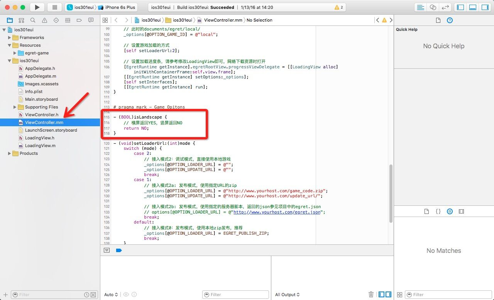
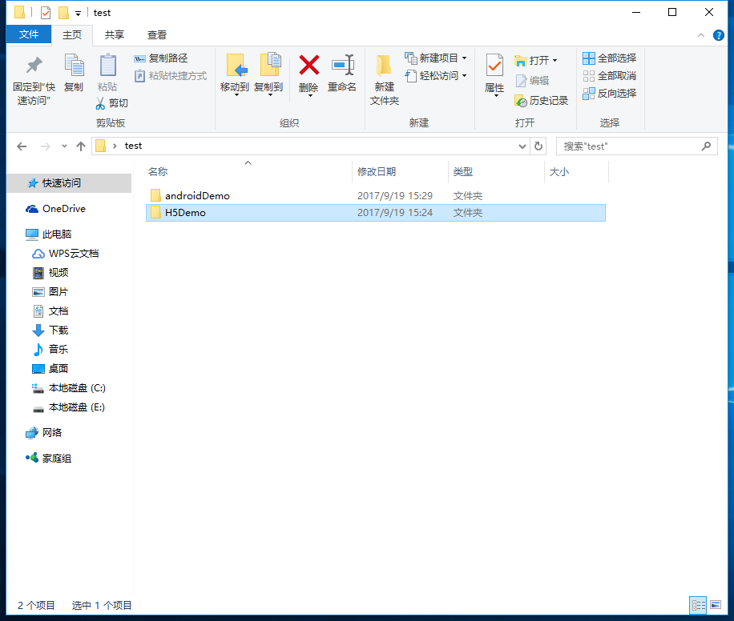
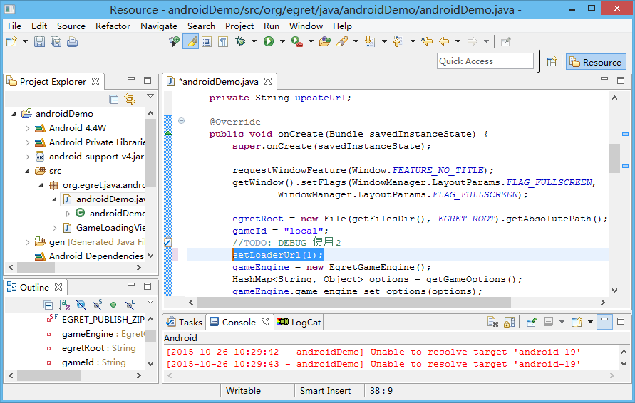
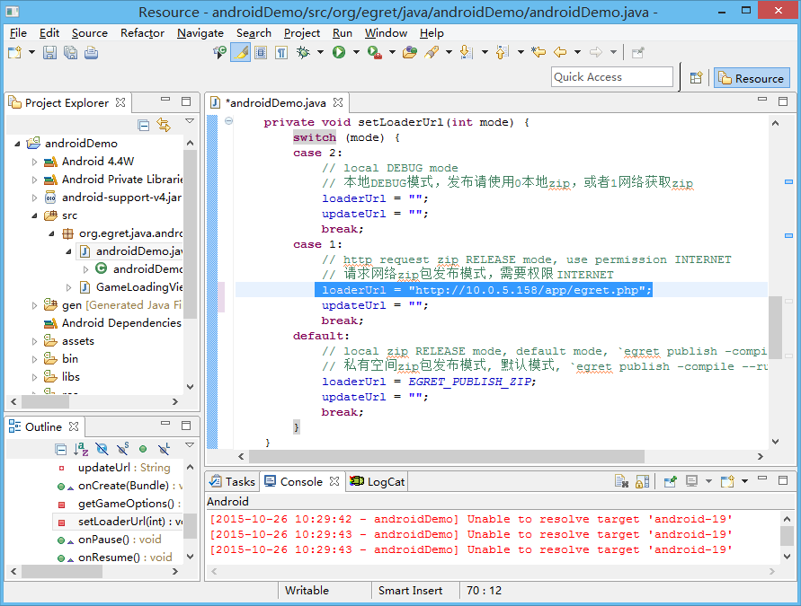
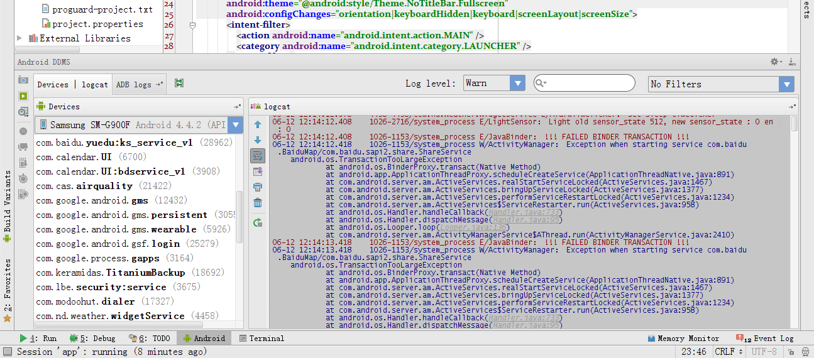
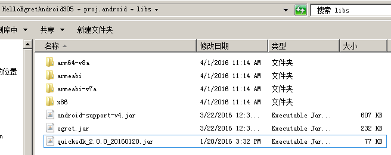
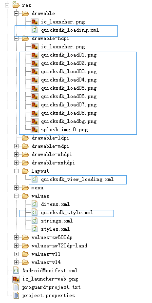
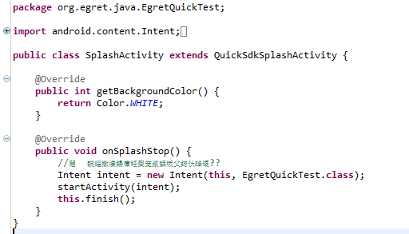
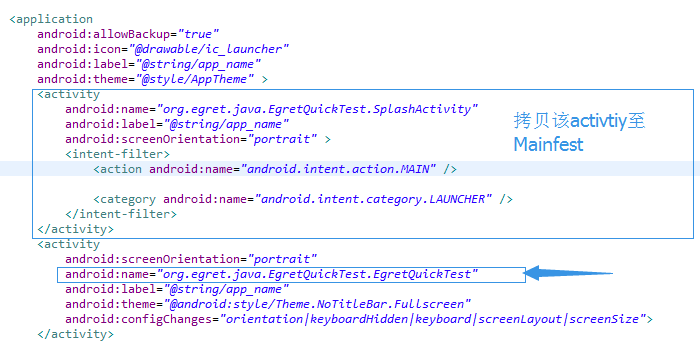
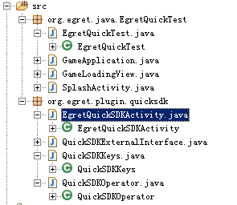

## 1.原生横屏设置

Eget 的 H5 项目通过 Egret Android Suppord 或 Egret IOS Support 可以生成相应的 Native 项目。如果需要设置项目的横竖屏等信息，需要在相应的 Native 项目中进行设置。

生成 Native 项目的基本过程是相同的，可以参考以下文档：

* Android APP打包：[打包Android app](http://developer.egret.com/cn/2d/publish/publish)
* IOS APP 打包: [打包iOS app](http://developer.egret.com/cn/2d/publish/publish)

### 1.1.Android 横竖屏设置

#### 在 Java 代码中设置

在 Java 中可以设置屏幕的旋转方向强制为横屏，代码如下：

```
setRequestedOrientation(ActivityInfo.SCREEN_ORIENTATION_LANDSCAPE)
```

其中 ActivityInfo 可以是以下值：

```
ActivityInfo.SCREEN_ORIENTATION_UNSPECIFIED,//未指定，此为默认值。由Android系统自己选择合适的方向。
ActivityInfo.SCREEN_ORIENTATION_LANDSCAPE,//横屏
ActivityInfo.SCREEN_ORIENTATION_PORTRAIT,//竖屏
ActivityInfo.SCREEN_ORIENTATION_USER,//用户当前的首选方向
ActivityInfo.SCREEN_ORIENTATION_BEHIND,//继承Activity堆栈中当前Activity下面的那个Activity的方向
ActivityInfo.SCREEN_ORIENTATION_SENSOR,//由物理感应器决定显示方向
ActivityInfo.SCREEN_ORIENTATION_NOSENSOR,//忽略物理感应器——即显示方向与物理感应器无关
```

#### 在 AndroidManifest.xml 中设置

在 egret 生成的 Android 项目的 proj.android 目录下可以找到 AndroidManifest.xml 配置文件,它是每个 Android 项目都必须的配置文件，提供了各项属性来详细描述应用程序的元数据。当然，在程序中修改的屏幕方向时要比在配置文件中的优先级要高的。

在 AndroidManifest.xml 可以找到 `android:screenOrientation` 字段，是配置项目横竖屏的字段。它可以有下列参数，与上面的基本一一对应：

* "unspecified": 由系统来判断显示方向.判定的策略是和设备相关的，所以不同的设备会有不同的显示方向.

* "landscape": 横屏显示(宽比高要长).

* "portrait": Android Support 模板设置的默认值，竖屏显示(高比宽要长).

* "user":用户当前首选的方向

* "behind": 与 Activity 堆栈中的下一个设置一致.

* "sensor":由物理的感应器来决定。如果用户旋转设备这屏幕会横竖屏切换.

* "nosensor":忽略物理感应器，这样就不会随着用户旋转设备而更改了("unspecified"设置除外)。


设置项目的横屏可以这样配置:

```
android:screenOrientation="landscape"
```

设置项目的竖屏可以这样配置:

```
android:screenOrientation="portrait"
```

### 1.2.iOS 项目设置横竖屏

#### 在 ViewController 中进行设置

iOS 项目内的屏幕方向可以使用 ViewController 或者 info.plist 来设置。ViewController 方法优先级要比在 info.plist 中直接设置高。推荐在 ViewController 中设置。

在 Egret IOS Support 提供的模板项目中可以找到相关的设置,在 HelloEgret 项目中找到 ViewController.mm ,如下图所示：



其中代码如下：

```
- (BOOL)isLandscape {
    // 横屏返回YES，竖屏返回NO
    return NO;
}
```

#### 在 info.plist 中进行设置

找到 `Supported Interface Orientations` ，在 iOS APP 默认支持四种屏幕方向：

* Portrait:正常的竖屏(top home button)

* PortraitUpsideDown:反向的竖屏(bottom home button)

* LandscapeLeft:左上角开始的横屏(left home button)

* LandscapeRight:右上角开始的横屏(right home button)


也可以在项目目录下直接找到 info.plist 文件，在 info.plist 可以找到`UISupportedInterfaceOrientations`和`UISupportedInterfaceOrientations~ipad`字段。

如果要设置横屏，可以将竖屏的两种模式删除，反之同理。

> 一般情况下不推荐修改 info.plist。 


## 2.热更新

阅读本部分内容之前,需要了解: [RES版本控制](/cn/docs/page/671)

Egret的封装项目无论在Android还是iOS平台，均支持热更新。

下文主要以Android平台为例来说明，iOS平台只需要在相应的配置和iOS入口类代码中进行不同的修改配置即可。

### 2.1.准备工作

在进行热更新之前，需要创建Eclipse的 Andorid 项目。对于导入 Eclipse 封装项目有疑惑的可以查阅以下文章：

- [打包Android app](http://developer.egret.com/cn/2d/publish/publish)
- [打包iOS app](http://developer.egret.com/cn/2d/publish/publish)

### 2.2.配置文件
在进行热更新发布之前，需要进行H5项目中 egretProperties.json 的配置。

使用 wing 在桌面文件夹 test 中新建名 h5Demo 的 Egret game项目。

使用命令行 `egret create_app` 在桌面文件夹 test 中新建名为  androidDemo 的 Andorid 项目。

最终文件结构如图：



打开H5中的配置文件 egretProperties.json ，文件结构如下：

	{
		"native": {
			"path_ignore": [],
			"android_path": "../androidDemo"
		},
		"publish": {
			"web": 0,
			"native": 1,
			"path": "bin-release"
		},
		"egret_version": "5.0.6",
		"template": {},
		"modules": [
			{
				"name": "egret"
			},
			{
				"name": "game"
			},
			{
				"name": "tween"
			},
			{
				"name": "res"
			},
    		{
      			"name": "promise",
      			"path": "./promise"
    		}
		]
	}

字段描述请查阅：[项目配置文件说明](../../../Engine2D/projectConfig/configFile/README.md) ，了解其中 “path_ignore”、“android_path”、“path” 即可。

> android_path是在执行`egret create_app`后自动添加。

### 2.3.Android项目设置

使用 Eclipse 导入刚创建的 androidDemo 项目，并找到入口文件 androidDemo.java 此处入口文件根据自己实际项目名进行更改。

需修改两处：

- 修改方法 setLoaderUrl 参数为1，默认是2，如图：



- 修改 setLoaderUrl 方法中 case 为 1 的 loaderUrl 与 updateUrl 变量，如图：

  

- case 2, 空字符串。即当前包使用最原始的格式。`egret build [-e] --runtime native` 之后的数据结构。
- default, 本地使用zip包方式。`egret publish --runtime native --version xxx` 之后，会将最新的资源包拷贝到Android项目中。此时如果需要在Android项目中测试。
- case 1, 一般这里为动态地址，根据请求的内容返回具体的 json 内容。只有使用这种方式才会有热更新机制，引擎会根据提供的 game_code.zip 的名称进行更新。


### 2.4.服务器端设置

APP每次启动会从事先设置好的HTTP（loaderUrl）地址请求更新内容进行对比。

我们需要搭建WEB服务器，百度一下，非常多的教程这里略。

服务器需要返回特定JSON格式：

	{
	"code_url": "http://10.0.5.158/app/151023172200/game_code_151023172200.zip",//游戏代码zip包路径
	"update_url": "http://10.0.5.158/app/151023172200" //游戏资源存放路径
	}

以PHP为例建立名为egret.php文件，内容如下：

	<?php
	define('CASE_NAME', '151023172200');
	
	function startsWith($string, $pattern) {
		return $pattern === "" || strrpos($string, $pattern, -strlen($string)) !== FALSE;
	}
	
	$json = array();  //不存在就false;
	if (!startsWith(CASE_NAME, 'http://')) {
		$ip = "http://10.0.5.155/app/";
		$root = $ip  . CASE_NAME ."/game_code_".CASE_NAME. ".zip";
		$update = $ip  . CASE_NAME;
		$json["code_url"] = $root;
		$json["update_url"] = $update;
	} else {
		$json["code_url"] = CASE_NAME;
		$json["update_url"] = dirname(CASE_NAME);
	}
	echo(json_encode($json));

其中 define('CASE_NAME', '151023172200'); 是每次APP更新时，需要替换的内容。我们看一下输出内容：


这里也可以直接是一个json文件，只要返回内容符合规范就可以。不限制语言。

### 2.5.发布更新版本

发布命令为：

	//version 后为自定义的版本文件夹，如果没有，则会自动生成一个数字串的文件夹,一般会省略。
    egret publish --runtime native --version xxx

找到开始时建立的 h5Demo 所在目录，执行发布命令

执行命令完成，h5Demo项目的 bin-release 文件夹中会包含我们需要更新的资源，如图：


拷贝 151026111628 文件夹到WEB服务器指定位置，并修改egret.php中常量即可完成更新：

    define('CASE_NAME', '151026111628')

最终egret.php输出的路径，可匹配 151026111628 文件即可。

现在我们可以修改背景 resource/assetsbg.jpg 文件，执行` egret publish --runtime native` 后更新文件夹到服务器，修改egret.php。打开你的APP，查看背景是否更新。

> 注：每次发布项目后，andorid 项目可能会被更新，需重新设置 setLoaderUrl 相关参数与内容。

### 2.6.总结

热更新的步骤可以概括为：

1. 修改 Android 封装项目入口文件的 setLoaderUrl 方法,并发布正式版本APP。
2. 每次H5版本有资源或代码修改，执行`egret publish --runtime native`发布命令。
3. 拷贝所生成的文件夹到WEB服务器，并修改服务器中更新路径。
4. 确保每次 zip 包的名称不一样。


## 3.调试技巧

在Android App打包运行过程中，有可能会发现一些问题，比如打包后黑屏无法正常运行。这时就需要使用Android的logcat调试功能来诊断问题。

在IntelliJ运行Android项目，会自动弹出Android标签，如图：



常规情况下，会显示整个系统的全部log，为了过滤掉不需要的信息，可以用进程过滤功能，只显示正在调试的app输出的log，选中该按钮，并选中要调试的app进程：


即便是以限定了一个app进程，仍然可能有大量不需要的信息，可以进一步根据log的类型进行过滤：


通常最常用到的是Warn和Error级别的log，因为这两个级别包含程序运行不正常时首先需要检查的信息。

Eclipse环境的logcat显示方法基本一致，可参考：[Android的logcat中如何根据标签去过滤掉不显示某些log信息](http://www.crifan.com/android_logcat_filter_out_not_show_some_log_item_info_by_tag/)

如在进行App打包过程中出现无法正常运行问题，请通过logcat取得关键报错信息，[发到官方论坛问答板块](http://bbs.egret-labs.org/forum.php?mod=forumdisplay&fid=44)，或在本教程评论直接反映，谢谢！

## 4.Egret 与 Native 通信基本技巧

### 4.1.准备工作

1、了解通过 egret-ios-support 打包为原生项目的方案，可以参考：

[打包iOS app](http://developer.egret.com/cn/2d/publish/publish)

[打包Android app](http://developer.egret.com/cn/2d/publish/publish)

2、了解 Egret 项目内的基本操作和 IOS 和 Android 编程基本技巧。

了解上面的基本知识之后可以通过建立一个新的 HelloWorld 项目来测试。

在 Egret 内，通过全局类`ExternalInterface`来与`native`进行通讯。

3、获得示例项目

下载好 Egret Android Support 和 Egret IOS Support 后可以在其相应目录下找到 HelloEgret 的模板项目。

Egret Android Support 可以在 `proj.android\src\org\egret\java\HelloEgret`路径下找到源码。

Egret IOS Support 可以在 `egret_ios_template\proj.ios\HelloEgret`路径下找到源码。

### 4.2.Native 向 Egret 发送消息

#### Egret 监听消息

通过`ExternalInterface`的`addCallback`方法来监听`Native`端发送来的消息。

```
// TypeScript 代码
egret.ExternalInterface.addCallback("sendToJS", function (message:string) {
    console.log("message form native : " + message);//message form native : message from native
});
```

上面我们调用`addCallback`,他的第一个参数"sendToJS",表示`Native`端发送的函数名。另外一个参数是回调函数，当 `Native` 端发送消息来时将调用回调函数，其中`message`就是`Native`端发送过来的值了。

#### Native 发送消息 

在原生代码中向 Egret 发送消息也比较简单，通过调用相应 API 向 Egret 发送消息。这里的参数都是两个，第一个是发送消息的`ID`,第二个为发送消息的值。当 Egret 内监听了同样 `ID`的消息，将收到该消息，并触发回调。这里我们使用上面 Egret 内监听的 `sendToJS` 为发送消息的 `ID`。

Android 对应发送消息代码:
```
// Java 代码
// gameEngine 在 onCreate 实例化出来。 
gameEngine.callEgretInterface("sendToJS", "message from Android");
```

IOS 对应发送消息代码：

```
/// Objective-C 代码 
[[EgretRuntime getInstance] callEgretInterface:@"sendToJS" value:@"message from IOS"];
```

### 4.3.Egret 向 Native 发送消息

#### Native 监听消息

##### Android 内监听消息

在 Android 内监听消息通过调用`EgretGameEngine`实例的`setRuntimeInterface`方法来实现。第一个参数仍然是需要监听的 ID,第二个参数需要实例化一个`IRuntimeInterface`,并重写他的`callback`方法。在其中接收回调的字符串。

首先要实现`IRuntimeInterface`:

```
private interface IRuntimeInterface {
    public void callback(String message);
}
```

Android 对应的监听消息的代码：
```
// Java 代码
//gameEngine 在 onCreate 实例化出来。
gameEngine.setRuntimeInterface("sendToNative", new IRuntimeInterface() {
           @Override
            public void callback(String message) {
                Log.d("externalInterface", "message : " + message);
            }
        });
```

##### IOS 内监听消息

IOS 部分对应接收代码,IOS部分监听回调也比较简单，同样调用`setRuntimeInterface`,两个参数分别是监听的ID  `sendToNative` 和回调函数.

IOS 对应的监听消息的代码：
```
/// Objective-C 代码 
[[EgretRuntime getInstance] setRuntimeInterface:@"sendToNative" 
    block:^(NSString * message) {
        NSLog(@"message :%@", message);
    }];
```

#### Egret 发送消息 

在`ExternalInterface`中，通过`call`方法向`native`发送消息。`call`中的两个参数分别是`functionName`和`value`,需要注意的是这两个参数都是字符串类型。`functionName`表示在 Native 端调用的函数回调名。也可以将此参数看成是函数回调的 ID ，有多个函数需要在 Native 端回调的时候可以通过此名称来区分。而`value`参数则比较好理解，表示要传给 Native 端的具体值。

```
// TypeScript 代码
egret.ExternalInterface.call("sendToNative", "message from js");   
```
比如上面代码发送了一段消息`message from js`给`Native`,当`Native`端添加了`sendToNative`的监听的时候，就可以在其回调函数中收到这个消息了。

## 5.Egret 项目接入 QuickSDK

### 5.1.简介

> QuickSDK 是一套解决手游快速接入渠道SDK的方案。

现在在 Egret Android 项目中也可以使用 [QuickSDK](http://www.quicksdk.net/index.html) 了（Egret Android Support 3.0.5 以上，Egret Engine 3.0.5 以上版本）。使用 QuickSDK 的主要流程如下:

* QuickSDK 官网注册账号创建游戏并配置相应参数。
* 游戏接入 QuickSDK。
* 一键打包为原生项目。
* 原生项目中接入 Egret QuickSDK。

开始接入之前请先阅读 [QuickSDK](http://www.quicksdk.net/doc.html?aid=13) 官方教程。

> 本篇主要介绍基于 Egret Android Support 的接入指导。

### 5.2.开始接入

下面主要介绍在使用 Egret Android Support 生成的原生项目中接入 QuickSDK 并接入 EgretQuickSDK。

#### 准备工作

##### 创建 QuickSDK 账号

在开始之前需要到 QuickSDK 官网[注册账号](http://www.quicksdk.net/register.html)，并创建游戏。接入 QuickSDK 主要需要获取产品参数(Product_Code,Product_Key,Callback_Key).如下图所示：


##### 获取示例项目

我们需要示例项目中的部分配置项目，所以直接获取[示例项目](http://sedn.egret.com/soft/quicksdk/egret_quicksdk_guider_and_demo2.zip)并拷贝到自己的工程中是很必要的。在开始之前请下载[示例项目](http://sedn.egret.com/soft/quicksdk/egret_quicksdk_guider_and_demo2.zip).

#### Egret 项目接入 QuickSDK

我们在原生项目接入之前可以先在 Egret H5 项目中接入 TypeScript 版的 EgretQuickSDK 程序包。

> 需要注意的是 EgretQuickSDK 只在 Egret Android Support 生成的原生项目中有效。在 Egret HTML 5 项目中接入可以方便再以后原生项目中调试接口。

在上面的[示例项目](http://sedn.egret.com/soft/quicksdk/egret_quicksdk_guider_and_demo2.zip)中可以找到 TypeScript 版的 EgretQuickSDK 程序包。

##### 添加 EgretQuickSDK 程序包

在我们的游戏项目中添加 EgretQuickSDK 程序包。如下图所示：


##### 初始化 QuickSDK

初始化 QuickSDK，在程序逻辑中添加初始化：

```
private quickSDKOperator: egret_quickSDK.QuickSDKOperator;

public initQuickSDKOperator(): void {
    this.quickSDKOperator = new egret_quickSDK.QuickSDKOperator();
}
```

在程序逻辑中调用 initQuickSDKOperator 即可初始化 QuickSDK.

##### 手动释放

需要注意的是，我们使用完 QuickSDK 之后需要手动释放 QuickSDK，以免循环引用。

```
public clear(): void {
    this.quickSDKOperator.clear();
}
```

#### 打包原生项目

可以使用如下命令一键打包为原生项目：

```
egret create_app app_name -f h5_game_path -t template_path
```

其中 app_name 是我们要生成的原生项目， h5_game_path 是 app 所对应的 H5 项目的路径，template_path 是 Android Support 模板项目的路径。

将我们上面的项目打包为原生项目：
 


参考教程:
[打包Android app](http://developer.egret.com/cn/2d/publish/publish)


##### 编译到原生项目

在有对应原生项目的情况下，可以使用命令：

```
egret build [project_name] --runtime native
```

将项 Egret H5 项目编译到对应的已生成的 Native 项目中去。


#### 原生项目中接入 QuickSDK

我们将上面生成好的原生项目 EgretQuickTest 导入到 eclipse 中，开始接入 QuickSDK。

##### 接入前检查

首先需要检查项目下的配置文件 AndroidManifest.xml ，为在以后接入渠道时不出问题，应确保有下面的设置。

* AndroidManifest.xml 中 android:targetSdkVersion="19"

避免渠道sdk不兼android 5.0的问题。

* 为Activity 添加横竖屏设置。根据游戏的横竖屏，将 activity 做横竖屏设置：

android:screenOrientation="sensorLandscape"

android:screenOrientation="sensorPortrait"

或者

android:screenOrientation="landscape"

android:screenOrientation="portrait"

* 检查权限:

```
<uses-permission android:name="android.permission.GET_TASKS" /> 
<uses-permission android:name="android.permission.WRITE_EXTERNAL_STORAGE" /> 
<uses-permission android:name="android.permission.ACCESS_WIFI_STATE" /> 
<uses-permission android:name="android.permission.INTERNET" /> 
<uses-permission android:name="android.permission.ACCESS_NETWORK_STATE" /> 
<uses-permission android:name="android.permission.ACCESS_WIFI_STATE" /> 
<uses-permission android:name="android.permission.READ_PHONE_STATE" /> 
<uses-permission android:name="android.permission.SYSTEM_ALERT_WINDOW" /> 
<uses-permission android:name="android.permission.BLUETOOTH" /> 
<uses-permission android:name="android.permission.BLUETOOTH_ADMIN" />
```

##### 添加 assets,libs,res

1. 添加 assests 

在[示例项目](http://sedn.egret.com/soft/quicksdk/egret_quicksdk_guider_and_demo_2.0.zip)中我们可以找到 quicksdk.xml 和 quickVersion 这两个文件。


将它们拷贝到我们的项目中的 assets 文件夹下。


2. 添加 libs

将示例项目中的以下文件拷贝到 libs 文件下。



拷贝到项目的 libs 文件夹下。


3. 添加 res

示例项目中 res 文件夹下的文件有选择的添加。将以下文件：



添加到相应文件夹。

##### 添加 Java 文件

直接将示例项目中的 GameApplication.java ， SplashActivity.java 复制粘贴到自己的项目中就行。注意要和自己的Activity在一个文件夹 下。

示例项目中将以下文件：


拷贝到我们项目相应文件夹下：


需要注意修改包名我们新创建的包名。



并注意在 AndroidMainfest.xml 中 添加application name:



到目前为止接入 QuickSDK 工作基本完成，运行该原生项目可以看到 QuickSDK 的 Splash，然后显示游戏画面。


##### Android 接入 EgretQuickSDK 

下面要做的就是给我们的项目接入 EgretQuickSDK。在我们的示例项目中可以找到 EgretQuickSDK 的源码。接入 EgretQuickSDK 之后即可对 QuickSDK 功能进行调试。

这里需要注意需要我们先准备好 QuickSDK 的 productCode 和 productKey。

* 添加 org.egret.plugin.quicksdk

添加 org.egret.plugin.quicksdk ，源代码可以在示例项目中获取到。




* 配置 QuickSDK 参数

找到我们导入的 EgretQuickSDKActivity 类，找到其中的配置参数，将其配置为我们自己注册的参数。


* 修改原游戏 Activity

修改我们原来游戏的 Activity ，使其继承自 EgretQuickSDKActivity：


并在游戏开始时初始化 EgretQuickSDK 环境。


至此，在 Egret 的原生 Android 接入 QuickSDK 已经完成。

### 5.3.注意事项

* 需要注意的是 EgretQuickSDK 只在 Egret Android Support 生成的原生项目中有效。
* 打包生成 Native 的过程中各个项目要放在同一盘符下，比如 D 盘。同时应避免放到 C 盘或桌面下。

## 6.其他原生支持

###	6.1.开启优化开关（Android&iOS）
**功能：**开启support对部分功能的优化。这些优化因为不稳定默认是关闭的。
**使用方法：**在native_require.js的egretInit函数中，修改egret_native.featureEnable的参数。例如打开渲染效率的优化方法如下：
~~~
var feature = {
	cmdBatch : true
};
egret_native.featureEnable(feature);
~~~
**参数：**一个js对象，目前有效的属性只有cmdBatch。如果以后添加新的优化项会在这里说明。


###	6.2.热更新地址不能访问时启动最后一次更新的游戏包（iOS）
**功能：**热更新地址不能访问时启动最后一次更新的游戏。
**使用方法：**在启动游戏之前，设置访问热更新地址的等待时间。修改ViewController的runGame方法，在启动EgretRuntime前调用：
 
**参数：**等待时间（秒）

###	6.3.切换音频解码方式（Android）
**功能：**选择是否默认优先使用PCM解码。默认是开启的，在大多数情况下，使用PCM解码速度更快，但是有的音频的时间会很长。
**使用方法：**在调用play事件之前，使用egret_native.setPcmDecodeEnable来开启或关闭。
**参数：**true/false


###	6.4.设置游戏所在View的背景透明（Android）
**功能：**设置游戏所在View的背景透明。
**使用方法：**在 getGameOptions 里添加属性：
~~~
options.put(EgretRuntime.OPTION_GAME_GLVIEW_TRANSPARENT, "true");
~~~
**说明：**背景设置为透明后，场景后面会有一个 EditText ，可以通过
~~~
((ViewGroup)gameEngineView).removeViewAt(0);
~~~
去掉。保留这个控件是为了兼容2.X 的引擎，默认是存在的，如果使用3.0以上的引擎版本则可以去掉。

###	6.5.设置游戏所在View在最顶层（Android）
**功能：**修改游戏所在View的层级
**使用方法：**将获取 gameEngineView 的方法由 game_engine_get_view 改为 game_engine_get_view_set_top ，将游戏所在的 View 放到最顶层
