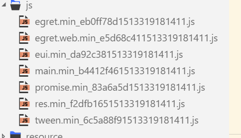

# 自定义插件使用说明

脚本插件目录结构

```
scripts
    |-- api.d.ts // 文档
    |-- config.ts // 构建脚本入口
		|-- myplugin.ts // 开发者自定义插件的示例
		|-- node.d.ts // node的.d.ts文件
```

* 开发者在build和publish的时候可以执行自定义插件，在项目构建时会执行config.ts文件中的buildConfig函数，这个函数的功能是返回一个对象，对象中的内容会根据执行不同的命令返回相对应的输出路径和需要执行的插件，插件在返回对象的commands数组中实例化后就会执行。


* 扩展的插件要实现plugins.Command接口，接口中有两个方法，onFile方法会在项目中的每个文件都会执行此函数，返回 file 表示保留此文件，返回 null 表示将此文件从构建管线中删除，传入的参数是实现了File接口的类型。onFinish方法会在所有文件均执行完后，最终会执行此函数，传入的参数是实现了CommandContext接口的类型。基本结构如图：


* 另外为了开发者的便利性，我们已经内置了几个常用的插件，详细的介绍请您查看api.d.ts文件。

* 开发插件示例：
我们要的功能很简单，只是在编译后js文件名添加这次编译的时间戳，以便达到对js文件版本控制。
首先在scripts文件中建立TestPlugin.ts文件，并实现plugins.Command接口。

```
export class TestPlugin implements plugins.Command {
    constructor() {
    }
    async onFile(file: plugins.File) {
        return file;
    }
    async onFinish(commandContext: plugins.CommandContext) {
    }
}
```

我们要保存时间戳和已修改的js文件名字，就要声明这几个属性来保存，然后在构造函数里生成时间戳，代码如下：

```
private timeStamp: number; //时间戳

private modifyInitial: Array<string> = []; //保存修改过的库文件js文件名字
private modifyGame: Array<string> = []; //保存修改过的main文件js文件名字

private manifestPath: string; //保存manifest路径

constructor() {
  this.timeStamp = Date.now();
}
```

然后我来扩展onFile的方法，先判断类型为js的文件，使用file.extname来判断，如果为js文件将生成好的时间戳加到js文件的名字上，我们还将所有修改的js文件重新放到manifest.json中，所以要将manifest路径和修改过的js文件名字保存起来以便我们后续修改，最后返回这个文件。代码如下：

```
async onFile(file: plugins.File) {
  const extName = file.extname;
  if (extName == ".js") {
    const pos = file.path.lastIndexOf(".");
    const prefix = file.path.slice(0, pos);
    const nowName = prefix + this.timeStamp + extName;
    file.path = nowName;

    if (file.basename.indexOf("main.min") >= 0) {
      this.modifyGame.push(file.relative);
    } else {
      this.modifyInitial.push(file.relative);
    }
  }

  if (file.basename.indexOf("manifest.json") >= 0) {
    this.manifestPath = file.relative;
  }
  return file;
}
```

我们还需在onFinish方法中处理manifest.json文件，先将所有保存好的js文件名字放到一个对象中，然后将这个对象转换为一个JSON字符串，最后保利用createFile方法修改manifest文件。代码如下：

```
async onFinish(commandContext: plugins.CommandContext) {
  let obj = {
    initial: this.modifyInitial,
    game: this.modifyGame
  };
  const serialize = JSON.stringify(obj);
  commandContext.createFile(this.manifestPath, new Buffer(serialize));
}
```	

现在我们已经完成了这小小的插件，要想使用还需要把我们的插件引入到config.ts文件中，首先使用import引入我们的插件，例：import { testPlugin } from './TestPlugin';然后在buildConfig的返回值的commands数组中实例化这个插件：new testPlugin()。最后执行命令egret publish命令的运行结果如图：
