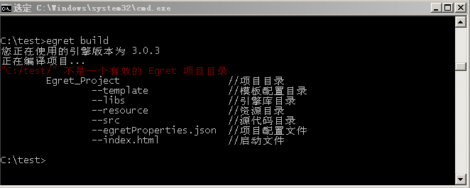

Egret Engine 3.0 包含了白鹭时代研发的遵循HTML5标准的2D引擎及全新打造的3D引擎，它解决了HTML5性能问题及碎片化问题，灵活地满足开发者开发2D或3D游戏的需求，并有着极强的跨平台运行能力。

下面介绍 Egret Engine 3.0.2 到 Egret Engine 3.0.3 之间的更新详情。

### Egret Engine 3D

在 Egret Engine 3D 春节后的第一个版本中,主要修复了一些问题,下面汇总了本次更新的改动:

1. 修复 MaterialData.clone 赋值错误的问题
2. 修复 View3D.delHUD 删除对象没有做检测的问题。
3. 修复骨骼动画回调的问题。
4. 修改 Input 内部事件注册方式。
5. 修改 canvas 的 zIndex 使 Egret Engine 3D 和 Egret Engine 2D 能够一起正常显示。
   
#### 联系我们

获取 Egret Engine 3D 的源码: [Egret Engine 3D](https://github.com/egret-labs/egret-3d)。

查阅 Egret Engine 3D API: [Egret Engine 3D API](http://edn.egret.com/cn/apidoc/index/name/egret3D.AnimaNodeCollection)。

更多关于 Egret Engine 3D 的教程欢迎关注 EDN [Egret Engine 3D 分类](http://edn.egret.com/cn/docs/page/775)。

在体验的过程中如果遇到任何问题希望您能留下宝贵意见，更欢迎大家在 Egret Engine 3D 论坛交流:[Egret3D 交流贴](http://bbs.egret.com/forum.php?mod=viewthread&tid=15653)。

Egret Engine 3D 官方交流群: 180593985 。

### Egret Engine 2D 

在 Egret Engine 2D 的 本次更新中，我们吸收开发者提供的反馈和建议，进一步稳定引擎并优化了一些体验。下面列出的是 3.0.2 到 3.0.3 的更新详情。 

#### ScrollBar 是否自动隐藏滚动条

在 Egret Engine 3.0.3 优化了 Scroller 的体验。当我们使用 Scroller 实现一些滚动区域的效果时，会发现右侧有一个滚动条(ScrollBar)，默认是自动隐藏的。即当我们不滚动时不会显示该滚动条。现在可以使用 ScrollBar （VScrollBar 和 HScrollBar） 的 `autoVisibility`属性，设置是否自动隐藏该滚动条。具体是如下的策略：

默认的 `autoVisibility` 属性为`true`,即自动隐藏的。当我们把 `autoVisibility` 的属性设置为 `false` 时，是否显示滚动条取决于 ScrollerBar 的 `visible` 属性，当 `visible` 为 `true` 时始终显示滚动条，为 `false` 时始终隐藏滚动条。

更多关于 `scroller` 的教程可以点击：[滚动控制容器](http://edn.egret.com/cn/docs/page/611#滚动条显示策略)

#### 9 宫格参数可为 0 

现在不限制 9 宫格的参数不能为 0 。

更多关于九宫格的使用请参考:[九宫格的使用](http://edn.egret.com/cn/docs/page/133)

#### 优化提示信息

当项目文件夹出错不能启动 Egret 引擎时，显示更详细的提示信息。比如我们再编译引擎时，如果出错会增加项目目录信息，如下所示：

#### 修复的其他问题

本次更新内容汇总了从引擎 3.0.2 到 3.0.3 的改动。

【优化】提升 Runtime 环境下，游戏资源过多时的加载速度。
【修复】textInput 设置 lineSpacing后，输入时候光标位置会往上跳一下的问题。
【修复】WebSocket 在 iOS 浏览器上发送数据会出现服务器解析错误的 问题。
【修复】文本移动时在屏幕上会有渲染残留的问题。
【修复】第三方库使用 ES5 编译时，会报错的问题。
【修复】DisplayObject.hitTestPoint 有锚点时不能被点击的问题。
