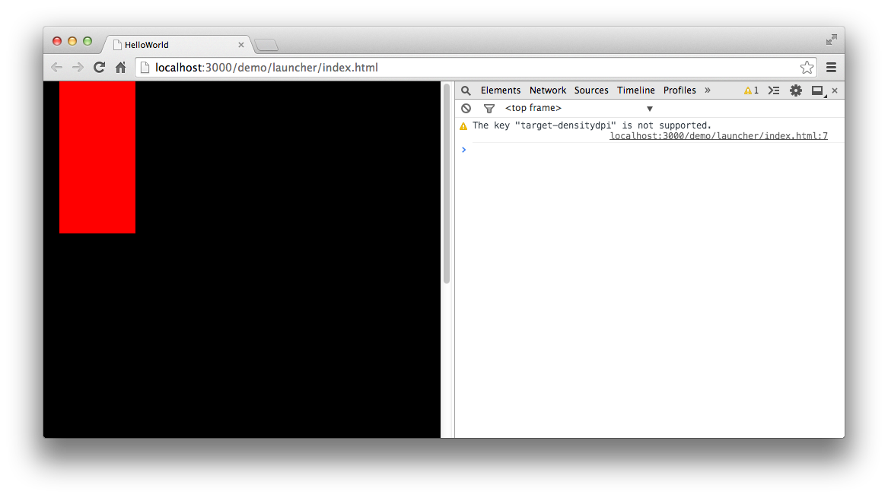
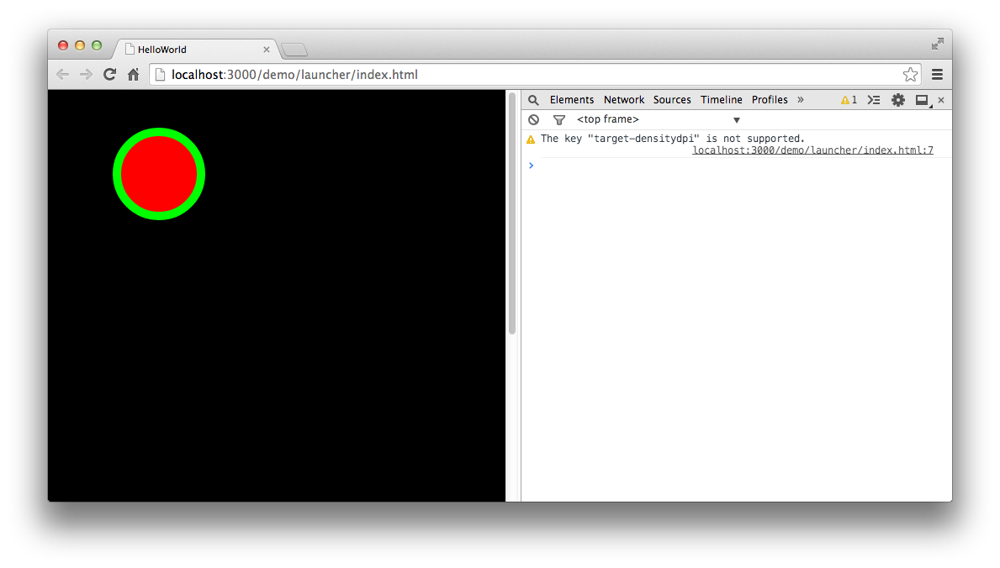
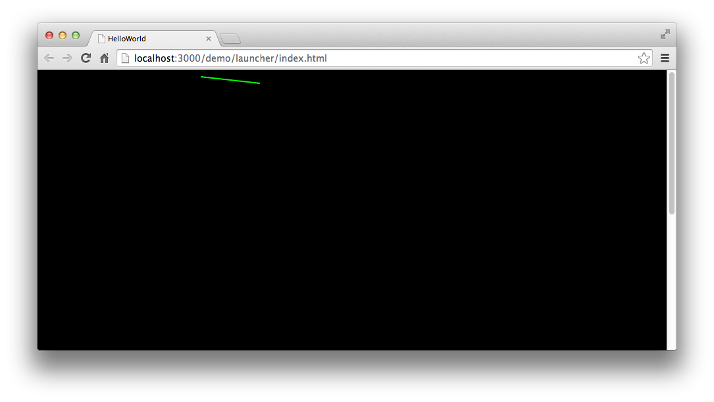
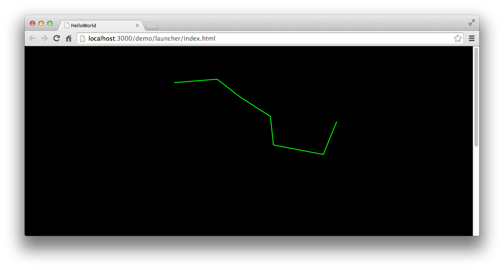
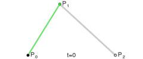
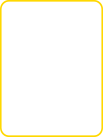
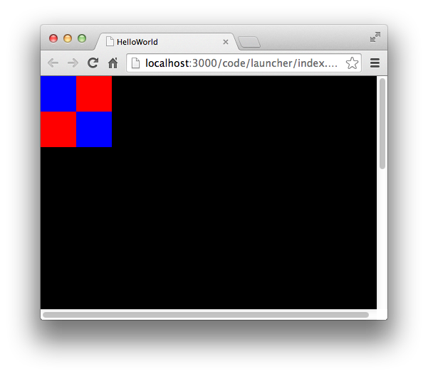

Egret中封装了 `Graphics` 类实现矢量绘图功能，可以绘制矩形、圆形、直线、曲线、圆弧等。下面介绍了矢量绘图功能的基本用法和若干高级用法。

## 1.绘制矩形

`Graphics` 类中封装的绘图方法不能直接使用，而需要在显示对象中使用。一些显示对象（如 `Shape` 和 `Sprite` ）中已经包含了绘图方法，因此可以在显示对象中直接调用这些方法进行绘图。

下面代码以 `Shape` 对象为例，绘制矩形的：

```
class GraphicsTest extends egret.DisplayObjectContainer
{
    public constructor()
    {
        super();
        this.addEventListener(egret.Event.ADDED_TO_STAGE,this.onAddToStage,this);
    }
    private onAddToStage(event:egret.Event)
    {
        var shp:egret.Shape = new egret.Shape();
        shp.graphics.beginFill( 0xff0000, 1);
        shp.graphics.drawRect( 0, 0, 100, 200 );
        shp.graphics.endFill();
        this.addChild( shp );
    }
}
```

编译后运行，效果如图：



这段代码中核心绘图代码是下面这三行:

```
shp.graphics.beginFill( 0xff0000, 1); 
shp.graphics.drawRect( 0, 0, 100, 200 ); 
shp.graphics.endFill();
```

访问 `shp` 的 `graphics` 属性会返回一个 `Graphics` 对象，操作此对象中的绘图方法即可实现绘图。

调用 `beginFill()` 方法设置矩形的填充颜色，这里将填充颜色设置为红色（颜色值0xff0000），同时将`alpha`设置为1，表示完全不透明。

调用 `drawRect()` 方法设置矩形的位置和大小，前两个参数分别为矩形左上角的X、Y轴坐标（相对于 `shp` 的锚点计算），后两个参数分别为矩形的宽和高，这里在 (0, 0) 点绘制了一个 100*200 的矩形。

调用 `endFill()` 方法结束当前绘制操作。

若要为矩形添加描边，需设置线条的样式，通过 `lineStyle()` 方法实现。

该方法的第一个参数是描边的线条宽度，第二个参数是描边的颜色。

为绘图代码添加一行:

```
shp.graphics.lineStyle( 10, 0x00ff00 );
```

修改后的代码如下：

```
class GraphicsTest extends egret.DisplayObjectContainer
{
    public constructor()
    {
        super();
        this.addEventListener(egret.Event.ADDED_TO_STAGE,this.onAddToStage,this);
    }
    private onAddToStage(event:egret.Event)
    {
        var shp:egret.Shape = new egret.Shape();
        shp.x = 20;
        shp.y = 20;
        shp.graphics.lineStyle( 10, 0x00ff00 );
        shp.graphics.beginFill( 0xff0000, 1);
        shp.graphics.drawRect( 0, 0, 100, 200 );
        shp.graphics.endFill();
        this.addChild( shp );
    }
}
```

编译并运行，效果如图：


## 2.绘制圆形

绘制圆形的方法与绘制矩形类似，只需将 `drawRect()` 方法改为 `drawCircle()` 方法。

```
drawCircle( x:number, y:number, radius:number): void
```

`drawCircle()` 方法接受三个参数，第一个参数为圆心的X轴坐标，第二个参数为圆心的Y轴坐标，第三个参数为半径。

>注意：圆心的X轴和Y轴位置是相对于 `Shape` 对象的锚点计算的.

下面代码示例绘制了一个半径为50像素的圆形：

```
class GraphicsTest extends egret.DisplayObjectContainer
{
    public constructor()
    {
        super();
        this.addEventListener(egret.Event.ADDED_TO_STAGE,this.onAddToStage,this);
    }
    private onAddToStage(event:egret.Event)
    {
        var shp:egret.Shape = new egret.Shape();
        shp.x = 100;
        shp.y = 100;
        shp.graphics.lineStyle( 10, 0x00ff00 );
        shp.graphics.beginFill( 0xff0000, 1);
        shp.graphics.drawCircle( 0, 0, 50 );
        shp.graphics.endFill();
        this.addChild( shp );
    }
}
```

编译并运行，效果如图：



## 3.绘制直线

使用Graphics绘制直线需要使用两个方法: `moveTo()` 和 `lineTo()`，它们输入参数是一对坐标值。`moveTo()` 负责绘制直线的起始点，`lineTo()` 负责绘制直线的终点。

```
moveTo( x:number, y:number): void
lineTo( x:number, y:number): void
```

在绘图直线前，需要先制定线条的样式，设置 `lineStyle()` 方法：

```
shp.graphics.lineStyle( 2, 0x00ff00 );
```

然后使用 `moveTo()` 来设定线条的起始点，使用 `lineTo()` 来设定线条的终点。完整代码如下：

```
class GraphicsTest extends egret.DisplayObjectContainer
{
    public constructor()
    {
        super();
        this.addEventListener(egret.Event.ADDED_TO_STAGE,this.onAddToStage,this);
    }
    private onAddToStage(event:egret.Event)
    {
        var shp:egret.Shape = new egret.Shape();
        shp.graphics.lineStyle( 2, 0x00ff00 );
        shp.graphics.moveTo( 10,10 );
        shp.graphics.lineTo( 100, 20 );
        shp.graphics.endFill();
        this.addChild( shp );
    }
}
```

编译后运行，效果如下图：



也可以连续绘制多条首尾相接的直线，形成一条折线，代码如下：

```
var shp:egret.Shape = new egret.Shape();

shp.graphics.lineStyle( 2, 0x00ff00 );

shp.graphics.moveTo( 68, 84 );

shp.graphics.lineTo( 167, 76 );

shp.graphics.lineTo( 221, 118 );

shp.graphics.lineTo( 290, 162 );

shp.graphics.lineTo( 297, 228 );

shp.graphics.lineTo( 412, 250 );

shp.graphics.lineTo( 443, 174 );

shp.graphics.endFill();

this.addChild( shp );
```

>绘制折线时，无需多次使用 `moveTo()` 方法，连续使用 `lineTo()` 方法即可。

编译后运行，效果如图：



## 4.绘制曲线
Egret中提供的曲线绘制是“二次贝塞尔曲线”，下图是“二次贝塞尔曲线”的结构图，其中P0是起始点，P1是控制点，P2是终点。


绘制曲线时，需使用 `Graphics` 中的 `curveTo()` 方法。

```
curveTo( x1:number, y1:number, x2:number, y2:number ): void
```

`curveTo()` 方法需设置4个参数，前两个参数是控制点(P1)的位置，后两个参数是终点(P2)的位置。

执行绘图时，先使用 `moveTo()` 方法指定曲线的起始点，然后使用 `curveTo()` 指定曲线的控制点和终点。在程序进行绘图时，绘制过程如下图：



示例代码：

```
class GraphicsTest extends egret.DisplayObjectContainer
{
    public constructor()
    {
        super();
        this.addEventListener(egret.Event.ADDED_TO_STAGE,this.onAddToStage,this);
    }
    private onAddToStage(event:egret.Event)
    {
        var shp:egret.Shape = new egret.Shape();
        shp.graphics.lineStyle( 2, 0x00ff00 );
        shp.graphics.moveTo( 50, 50);
        shp.graphics.curveTo( 100,100, 200,50);
        shp.graphics.endFill();
        this.addChild( shp );
    }
}
```

编译后运行，效果如图：


## 5.绘制圆弧

绘制封闭圆弧使用 `Graphics` 中的 `drawArc()` 方法。

```
drawArc( x:number, y:number, radius:number, startAngle:number, endAngle:number, anticlockwise:boolean ):void
```

前两个参数是圆弧路径的圆心位置，`radius` 是圆弧半径。`startAngle` 是圆弧起点的角度，从x 轴方向开始计算，以弧度为单位，`endAngle` 是圆弧终点的角度，`anticlockwise` 控制绘制方向，如果为 true，逆时针绘制圆弧，反之，顺时针绘制。

下面的例子绘制了一个从 0 到 π 的圆弧：

```
class GraphicsTest extends egret.DisplayObjectContainer
{
    public constructor()
    {
        super();
        this.addEventListener(egret.Event.ADDED_TO_STAGE,this.onAddToStage,this);
    }
    private onAddToStage(event:egret.Event)
    {
        var shp:egret.Shape = new egret.Shape();
        shp.graphics.beginFill( 0x1122cc );
        shp.graphics.drawArc(200,200,100,0,Math.PI,true);
        shp.graphics.endFill();
        this.addChild( shp );
    }
}
```

编译并运行，效果如图：


其中 endAngle 使用 `Math.PI` 表示弧度 π ，可以在数学相关API里查询到。

http://developer.egret.com/cn/apidoc/index/name/global.Math

## 6.绘制圆弧高级使用

### 6.1.画弧

~~~
var shape:egret.Shape = new egret.Shape();
shape.graphics.lineStyle(2, 0xffff00);
shape.graphics.drawArc(50, 50, 50, 0, Math.PI / 180 * 30, false);
shape.graphics.endFill();
~~~


### 6.2.画拱形

~~~
var shape:egret.Shape = new egret.Shape();
shape.graphics.beginFill(0xff0000);
shape.graphics.drawArc(50, 50, 50, 0, Math.PI / 180 * 60, false);
shape.graphics.endFill();
~~~


> 画拱和画弧的区别就是：画拱需要填充图形，画弧不需要填充图形。

### 6.3.画扇形

扇形其实就是圆心跟弧的2个端点连接后的一个封闭区域。

~~~
var r:number = 50;
var shape:egret.Shape = new egret.Shape();
shape.graphics.beginFill(0xff0000);
shape.graphics.moveTo(r, r);//绘制点移动(r, r)点
shape.graphics.lineTo(r * 2, r);//画线到弧的起始点
shape.graphics.drawArc(50, 50, 50, 0, 260 * Math.PI / 180, false);//从起始点顺时针画弧到终点
shape.graphics.lineTo(r, r);//从终点画线到圆形。到此扇形的封闭区域形成
shape.graphics.endFill();
~~~


### 6.4.画弧形进度条

~~~
private getArcProgress():egret.Shape {
    var shape:egret.Shape = new egret.Shape();
    var angle:number = 0;
    egret.startTick(function (timeStamp:number):boolean {
        angle += 1;
        changeGraphics(angle);
        angle = angle % 360;

        return true;
    }, this);

    function changeGraphics(angle) {
        shape.graphics.clear();

        shape.graphics.lineStyle(2, 0x0000ff, 1);
        shape.graphics.drawArc(50, 50, 50, 0, angle * Math.PI / 180, false);
        shape.graphics.endFill();
    }
}
~~~

关于代码中 `egret.startTick` 的用法，可参考[Timer计时器](../../timeControl/timer)

### 6.5.画扇形进度条

~~~
private getSectorProgress():egret.Shape {
    var shape:egret.Shape = new egret.Shape();

    var angle:number = 0;
    egret.startTick(function (timeStamp:number):boolean {
        angle += 1;
        changeGraphics(angle);
        angle = angle % 360;

        return true;
    }, this);
    
    return shape;

    function changeGraphics(angle) {
        shape.graphics.clear();

        shape.graphics.beginFill(0xff0000);
        shape.graphics.moveTo(50, 50);
        shape.graphics.lineTo(100, 50);
        shape.graphics.drawArc(50, 50, 50, 0, angle * Math.PI / 180, false);
        shape.graphics.lineTo(50, 50);
        shape.graphics.endFill();
    }
}
~~~

### 6.6.画不规则边框进度条

下面是一个示例，通过结合遮罩 (`mask`) 和扇形进度条来模拟边框的进度显示。关于 `mask` 的具体用法，可参考[遮罩](../../mask/rectangleMask)

* 首先，提供一个只有边框的全封闭的图形。比如



* 使用上面介绍的扇形进度条，并确保扇形确定的圆的区域可以完整覆盖边框图。要将扇形的圆心对准边框中心。

* 将边框的 `mask` 设置成扇形进度条，至此一个简单的边框进度条已完成。可以通过修改被遮罩图形，来做成适合项目的进度条，比如图形不是一个边框，而是一个灰色框的填充图。


* 代码:

~~~
private drawBorderProgress():egret.DisplayObjectContainer {
    var container:egret.DisplayObjectContainer = new egret.DisplayObjectContainer();
    var w:number = 100;
    var h:number = 100;
    var r:number = Math.max(w, h) / 2 * 1.5;
    var bitmap = new egret.Bitmap(RES.getRes(key));
    container.addChild(bitmap);
    bitmap.width = w;
    bitmap.height = h;

    var shape:egret.Shape = new egret.Shape();
    shape.x = bitmap.width / 2;
    shape.y = bitmap.height / 2;

    bitmap.mask = shape;
    container.addChild(shape);

    var angle = 0;
    egret.startTick(function (timeStamp:number):boolean {
        angle += 1;
        changeGraphics(angle);
        angle = angle % 360;

        return true;
    }, this);

    return container;

    function changeGraphics(angle) {
        shape.graphics.clear();

        shape.graphics.beginFill(0x00ffff, 1);
        shape.graphics.lineTo(r, 0);
        shape.graphics.drawArc(0, 0, r, 0, angle * Math.PI / 180, true);
        shape.graphics.lineTo(0, 0);
        shape.graphics.endFill();
    }
}
~~~

* 效果图

   


> `mask` 很消耗 cpu，建议少用不停修改 `mask` 的方式做动画。

## 7.多个形状的绘制

以下代码在一个 `Shape` 对象中绘制4个小格子，互相紧邻，并且红蓝相间。

```
this.graphics.beginFill( 0x0000ff );
this.graphics.drawRect( 0, 0, 50,50 );
this.graphics.endFill();

this.graphics.beginFill( 0x0000ff );
this.graphics.drawRect( 50, 50, 50, 50);
this.graphics.endFill();

this.graphics.beginFill( 0xff0000 );
this.graphics.drawRect( 50, 0, 50,50 );
this.graphics.endFill();

this.graphics.beginFill( 0xff0000 );
this.graphics.drawRect( 0, 50, 50,50 );
this.graphics.endFill();
```

将该 `Shape` 对象放到显示列表，编译运行，得到如图效果：



>注意：多个形状绘制，互相是独立的，每一次绘制填充，都必须以 `endFill()` 结束，才能开始下一次绘制。


## 8.清空绘图

清空绘图操作是将已经绘制的图像全部清空，可以执行 `Graphics` 中的 `clear()` 方法，代码如下：

```
shp.graphics.clear();
```
