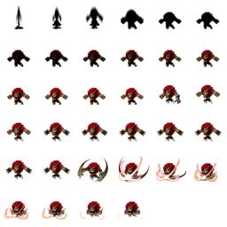

     
## 精灵表   
精灵表是2D常用的一种切帧动画形式。大概来说，就是将动画的每一帧作为一个完整的图像，将所有不同的帧集中到一个大的透明图像中，每一帧都有其对应的起始坐标点及其宽度、高度，这张大的透明图像称为精灵表纹理集。这样在播放动画时，只需要在不同的时间帧，在精灵表纹理集中，取该时间帧对应的动画帧纹理，并显示出来。      

## 呈现UV精灵表动画      
本节完整的测试项目，请使用Egret3D的官方例子库中：[UV精灵表动画例子](https://github.com/egret-labs/egret-3d/blob/master/Sample-wing/src/SampleUvSpriteSheet.ts)，可以运行`Sample-wing`项目，并修改`Main.ts`中的`sample`所在行为`var sample = new SampleUvSpriteSheet;`即可。            
本例所用的精灵表纹理集图片为：   
    


首先，创建一个UV精灵表对象：    
```
var uvSpriteSheetMethod: egret3d.UVSpriteSheetMethod = new egret3d.UVSpriteSheetMethod(34,6,6,3.0);
```
该精灵表构造函数需要依次传入精灵表动画的数据： 总帧数、行数、列数以及总的播放时间。    
UV精灵表对象需要通过材质的漫反射通道加入：    
```
this.matPlane.diffusePass.addMethod(uvSpriteSheetMethod);
```   
再启动UV精灵表对象播放即可：   
```
uvSpriteSheetMethod.start(true);
```
在贴图纹理图片加载完成后设置好贴图：  
```
protected onLoadDiffuse(evt: egret3d.LoaderEvent3D) {
	this.matPlane.diffuseTexture = evt.loader.data;
}
```    
