使用wing创建项目
----------

* 下载安装wing

----------

	登陆白鹭引擎官方网站，成功下载并安装EgretEngine和wing后启动，如图所示：

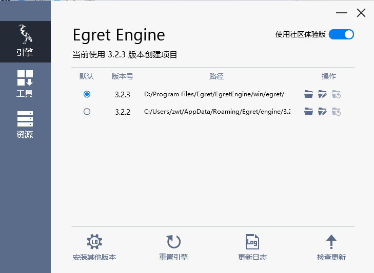
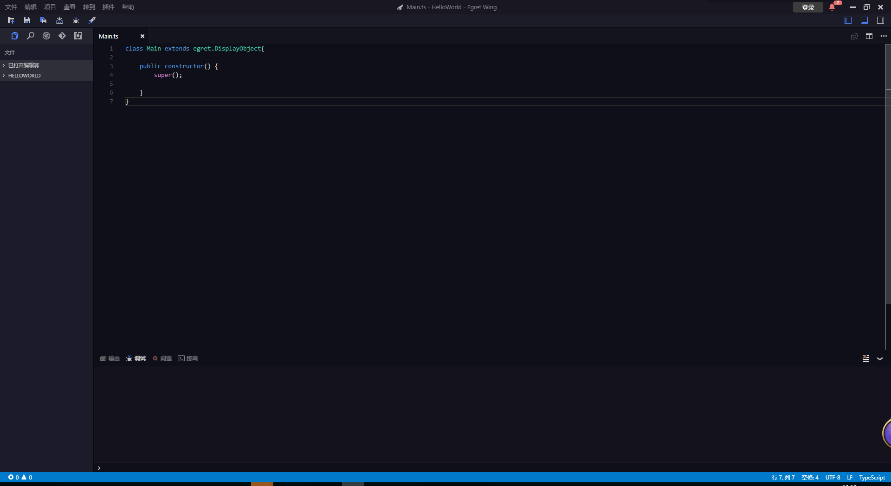

----------

* 创建Egret3D项目工程

----------

	打开文件->新建项目，选择Egret3D项目，输入名称HelloWorld后，点击完成，点击运行查看导出默认3d内容。

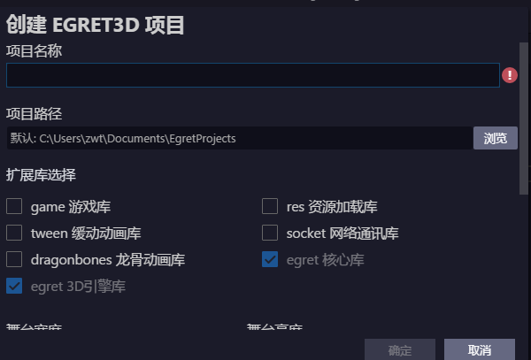
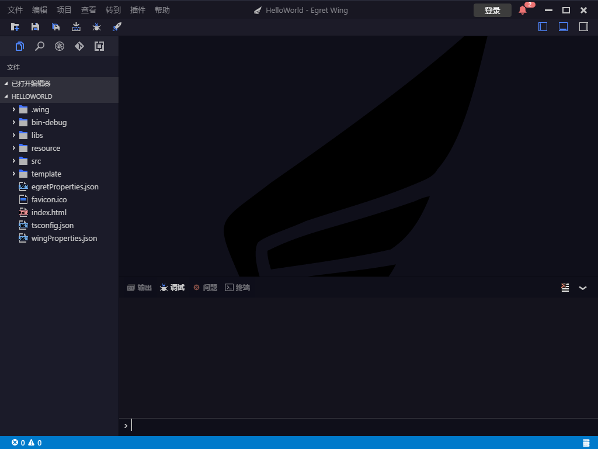
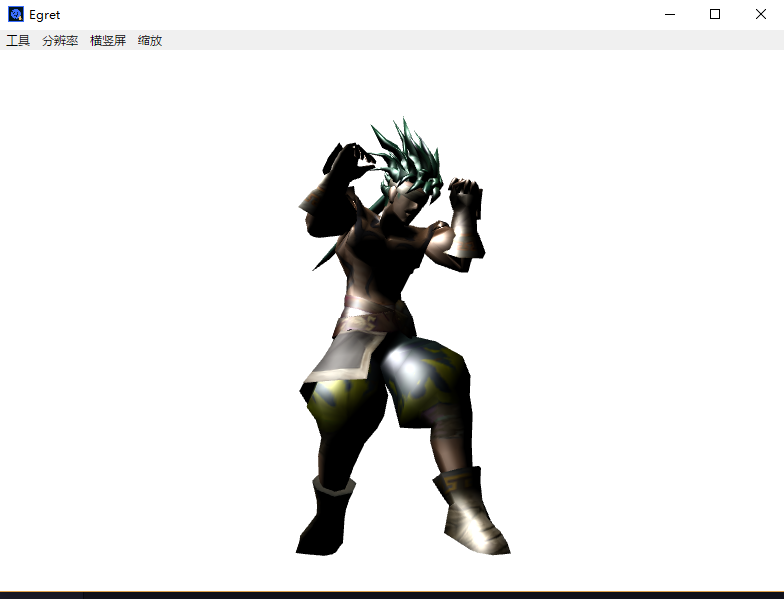

----------

* Hello Egret3D

----------

	1) 打开src文件夹下的Main.ts文件，删除模板代码。输入如下代码：
	
	class Main extends egret.DisplayObject{
		
	    public constructor() {
	        super();
	        
	    }
	}     

	2) 打开index.html文件，修改<body></body>内代码,如下所示：

	<body>
	
	    

	    

	    
	    
	    
	</body>

----------

* 创建Egret3DCanvas

----------
	
	1）什么是Egret3DCanvas：
		a) Egret3DCanvas可以理解为渲染的画布，为我们绘制画面提供支持。
		b) Egret3DCanvas构造后，需要定义起始点位置，和画布大小来控制我们显示内容的位置。
		c) 它继承EventDispatcher，可以监听部分事件，如：Event3D.ENTER_FRAME，每帧响应回调事件。
		d) 一个Egret3DCanvas可以渲染多个View3D内容，至于View3D的内容以及与Egret3DCanvas关系将在下一节说明。
		e) 代码示例：

			class Main extends egret.DisplayObject {
			
			    // Canvas操作对象
			    protected _egret3DCanvas: egret3d.Egret3DCanvas;
			
			    public constructor() {
			        super();
			        console.log("Hello World,Hello Egret3D");
			        //创建Canvas对象。
			        this._egret3DCanvas = new egret3d.Egret3DCanvas();
			        //Canvas的起始坐标，页面左上角为起始坐标(0,0)。
			        this._egret3DCanvas.x = 0;
			        this._egret3DCanvas.y = 0;
			        //设置Canvas页面尺寸。
			        this._egret3DCanvas.width = window.innerWidth;
			        this._egret3DCanvas.height = window.innerHeight;
			        //启动_egret3DCanvas
			        this._egret3DCanvas.start();
			        
			    }
			}

----------

* 创建View3D

----------

	1）什么是View3D：
		a) View3D是整个3D引擎的渲染视口，可以控制渲染窗口的大小，渲染的方式。
		b) View3D内可以控制相机Camera3D，场景元素Scene3D，当前的View3D中会有一个Scene3D的节点和一个Camera3D来进行场景中的渲染。
		c) View3D创建后，一般会保存在Engre3DCanvas中的View3D列表内，Engre3DCanvas会依次调用列表内View3D的主循环方法:
			public update(time: number, delay: number)。
		d）Engre3DCanvas与View3D关系图：

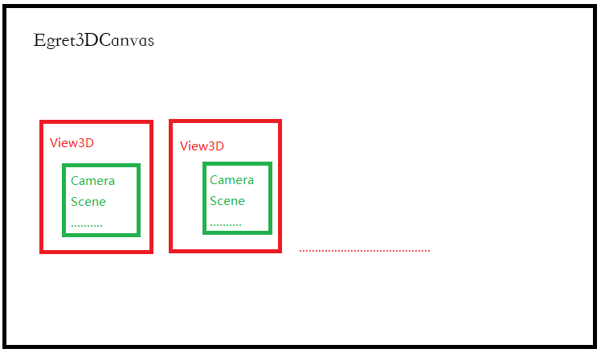

		e) 代码示例：

			class Main extends egret.DisplayObject {
			
			
			    // Canvas操作对象
			    protected _egret3DCanvas: egret3d.Egret3DCanvas;
			    // View3D操作对象
			    protected _view3D: egret3d.View3D;
			
			    public constructor() {
			        super();
			        //创建Canvas对象。
			        this._egret3DCanvas = new egret3d.Egret3DCanvas();
			        //Canvas的起始坐标，页面左上角为起始坐标(0,0)。
			        this._egret3DCanvas.x = 0;
			        this._egret3DCanvas.y = 0;
			        //设置Canvas页面尺寸。
			        this._egret3DCanvas.width = window.innerWidth;
			        this._egret3DCanvas.height = window.innerHeight;
			
			        //创建View3D对象,页面左上角为起始坐标(0,0)
			        this._view3D = new egret3d.View3D(0, 0, window.innerWidth, window.innerHeight);
			        //当前对象对视位置,其参数依次为:
			        //@param pos 对象的位置
			        //@param target 目标的位置
			        this._view3D.camera3D.lookAt(new egret3d.Vector3D(0, 0, 1000), new egret3d.Vector3D(0, 0, 0));
			        //View3D的背景色设置
			        this._view3D.backColor = 0xffffff;
			        //将View3D添加进Canvas中
			        this._egret3DCanvas.addView3D(this._view3D);
			
			
			        //启动_egret3DCanvas
			        this._egret3DCanvas.start();
			
			
			        console.log("Hello World,Hello Egret3D");
			    }
			}

----------

* 添加物体

----------

	1）Egret3D内定义了许多内置模型，比如CubeGeometry，CylinderGeometry，PlaneGeometry等常用模型数据，这里我们选取PlaneGeometry和CubeGeometry
		作为内容，添加至引擎内。
		a）示例代码：

			class Main extends egret.DisplayObject {
			
			
			    // Canvas操作对象
			    protected _egret3DCanvas: egret3d.Egret3DCanvas;
			    // View3D操作对象
			    protected _view3D: egret3d.View3D;
			
			    public constructor() {
			        super();
			        //创建Canvas对象。
			        this._egret3DCanvas = new egret3d.Egret3DCanvas();
			        //Canvas的起始坐标，页面左上角为起始坐标(0,0)。
			        this._egret3DCanvas.x = 0;
			        this._egret3DCanvas.y = 0;
			        //设置Canvas页面尺寸。
			        this._egret3DCanvas.width = window.innerWidth;
			        this._egret3DCanvas.height = window.innerHeight;
			
			        //创建View3D对象,页面左上角为起始坐标(0,0)
			        this._view3D = new egret3d.View3D(0, 0, window.innerWidth, window.innerHeight);
			        //当前对象对视位置,其参数依次为:
			        //@param pos 对象的位置
			        //@param target 目标的位置
			        this._view3D.camera3D.lookAt(new egret3d.Vector3D(0, 1000, 1000), new egret3d.Vector3D(0, 0, 0));
			        //View3D的背景色设置
			        this._view3D.backColor = 0xffffff;
			        //将View3D添加进Canvas中
			        this._egret3DCanvas.addView3D(this._view3D);
			
			
			        //启动_egret3DCanvas
			        this._egret3DCanvas.start();
			
			
			        //创建立方体，放置于场景内(0,0,0)位置
			        //创建一个红色的颜色材质球
			        var mat_cube: egret3d.ColorMaterial = new egret3d.ColorMaterial(0xff0000);
			        //使用内置cube数据构造出一个默认参数cube
			        var geometery_Cube: egret3d.CubeGeometry = new egret3d.CubeGeometry();
			        //通过材质球和geometery数据创建一个mesh对象
			        var cube = new egret3d.Mesh(geometery_Cube, mat_cube);
			        //将mesh节点添加到View3D内
			        this._view3D.addChild3D(cube);
			
			
			        ///创建面片，放置于场景内(0,0,0)位置
			        ///创建一个绿色的颜色材质球
			        var mat_Plane: egret3d.ColorMaterial = new egret3d.ColorMaterial(0x00ff00);
			        //使用内置Plane数据构造出一个默认参数Plane
			        var geometery_Plane: egret3d.PlaneGeometry = new egret3d.PlaneGeometry();
			         //通过材质球和geometery数据创建一个mesh对象
			        var plane = new egret3d.Mesh(geometery_Plane, mat_Plane);
			        //将mesh节点添加到View3D内
			        this._view3D.addChild3D(plane);
			
			
			        console.log("Hello World,Hello Egret3D");
			    }
			}

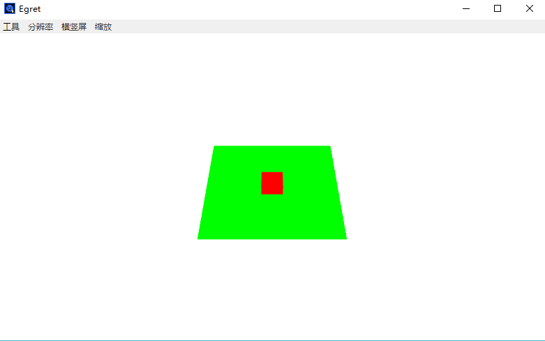

	2）除了使用内置数据生成模型数据，我们还可以使用自己定义的数据来构建模型。
		a) 示例代码：

			class Main extends egret.DisplayObject {
			
			
			    // Canvas操作对象
			    protected _egret3DCanvas: egret3d.Egret3DCanvas;
			    // View3D操作对象
			    protected _view3D: egret3d.View3D;
			
			    public constructor() {
			        super();
			        //创建Canvas对象。
			        this._egret3DCanvas = new egret3d.Egret3DCanvas();
			        //Canvas的起始坐标，页面左上角为起始坐标(0,0)。
			        this._egret3DCanvas.x = 0;
			        this._egret3DCanvas.y = 0;
			        //设置Canvas页面尺寸。
			        this._egret3DCanvas.width = window.innerWidth;
			        this._egret3DCanvas.height = window.innerHeight;
			
			        //创建View3D对象,页面左上角为起始坐标(0,0)
			        this._view3D = new egret3d.View3D(0, 0, window.innerWidth, window.innerHeight);
			        //当前对象对视位置,其参数依次为:
			        //@param pos 对象的位置
			        //@param target 目标的位置
			        this._view3D.camera3D.lookAt(new egret3d.Vector3D(0, 500, 500), new egret3d.Vector3D(0, 0, 0));
			        //View3D的背景色设置
			        this._view3D.backColor = 0xffffff;
			        //将View3D添加进Canvas中
			        this._egret3DCanvas.addView3D(this._view3D);
			
			
			        //启动_egret3DCanvas
			        this._egret3DCanvas.start();
			
			
			        //创建立方体，放置于场景内(0,0,0)位置
			        //创建一个红色的颜色材质球
			        var mat_cube: egret3d.ColorMaterial = new egret3d.ColorMaterial(0xff0000);
			        //使用内置cube数据构造出一个默认参数cube
			        var geometery_Cube: egret3d.CubeGeometry = new egret3d.CubeGeometry();
			        //通过材质球和geometery数据创建一个mesh对象
			        var cube = new egret3d.Mesh(geometery_Cube, mat_cube);
			        //将mesh节点添加到View3D内
			        this._view3D.addChild3D(cube);
			
			
			        ///创建面片，放置于场景内(0,0,0)位置
			        ///创建一个绿色的颜色材质球
			        var mat_Plane: egret3d.ColorMaterial = new egret3d.ColorMaterial(0x00ff00);
			        //使用内置Plane数据构造出一个默认参数Plane
			        var geometery_Plane: egret3d.PlaneGeometry = new egret3d.PlaneGeometry();
			        //通过材质球和geometery数据创建一个mesh对象
			        var plane = new egret3d.Mesh(geometery_Plane, mat_Plane);
			        //将mesh节点添加到View3D内
			        this._view3D.addChild3D(plane);
			
			        //自定三角面
			        this.createTriangle();
			
			        console.log("Hello World,Hello Egret3D");
			    }
			
			    //自定义数据构造一个三角面片
			    protected createTriangle() {
			        var geom: egret3d.Geometry = egret3d.GeometryUtil.createGeometry();
			
			        var vb: number[] = [];
			        var ib: number[] = [];
			
			        // 0 1 2 坐标 3 4 5 6 颜色 7 8 uv
			        vb.push(-50, -50, 0, 1, 0, 0, 1);
			        vb.push(0, 50, 0, 0, 1, 0, 1);
			        vb.push(50, -50, 0, 0, 0, 1, 1);
			        // 加入3个顶点       
			
			        // 设置顶点索引  3个索引  1个3角形面
			        ib.push(0, 1, 2);
			
			        // 把数据填充进Geometry
			        geom.setVerticesForIndex(0, egret3d.VertexFormat.VF_POSITION | egret3d.VertexFormat.VF_COLOR, vb, 3);
			        geom.setVertexIndices(0, ib);
			
			        // 使用Geometry 创建Mesh
			        var mesh: egret3d.Mesh = new egret3d.Mesh(geom, new egret3d.ColorMaterial(0xffffff));
			
			        // 设置双面渲染
			        mesh.material.bothside = true;
			
			        this._view3D.addChild3D(mesh);
			
			        mesh.x = -200;
			    }
			
			
			}

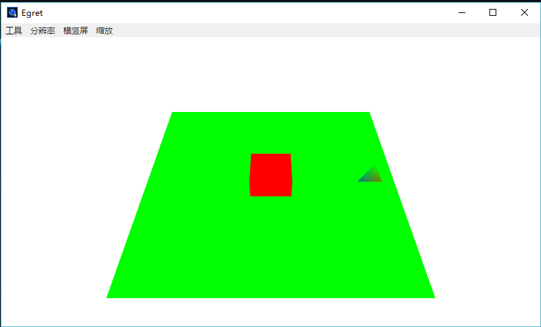

		2）除了颜色材质球的使用，引擎还提供贴图材质球的使用。
			a) 示例代码：

			class Main extends egret.DisplayObject {
			
			
			    // Canvas操作对象
			    protected _egret3DCanvas: egret3d.Egret3DCanvas;
			    // View3D操作对象
			    protected _view3D: egret3d.View3D;
			
			    public constructor() {
			        super();
			        //创建Canvas对象。
			        this._egret3DCanvas = new egret3d.Egret3DCanvas();
			        //Canvas的起始坐标，页面左上角为起始坐标(0,0)。
			        this._egret3DCanvas.x = 0;
			        this._egret3DCanvas.y = 0;
			        //设置Canvas页面尺寸。
			        this._egret3DCanvas.width = window.innerWidth;
			        this._egret3DCanvas.height = window.innerHeight;
			
			        //创建View3D对象,页面左上角为起始坐标(0,0)
			        this._view3D = new egret3d.View3D(0, 0, window.innerWidth, window.innerHeight);
			        //当前对象对视位置,其参数依次为:
			        //@param pos 对象的位置
			        //@param target 目标的位置
			        this._view3D.camera3D.lookAt(new egret3d.Vector3D(0, 500, 500), new egret3d.Vector3D(0, 0, 0));
			        //View3D的背景色设置
			        this._view3D.backColor = 0xffffff;
			        //将View3D添加进Canvas中
			        this._egret3DCanvas.addView3D(this._view3D);
			
			
			        //启动_egret3DCanvas
			        this._egret3DCanvas.start();
			
			
			        //创建立方体，放置于场景内(0,0,0)位置
			        //创建一个默认的贴图材质球
			        var mat_cube: egret3d.TextureMaterial = new egret3d.TextureMaterial();
			        //使用内置cube数据构造出一个默认参数cube
			        var geometery_Cube: egret3d.CubeGeometry = new egret3d.CubeGeometry();
			        //通过材质球和geometery数据创建一个mesh对象
			        var cube = new egret3d.Mesh(geometery_Cube, mat_cube);
			        //将mesh节点添加到View3D内
			        this._view3D.addChild3D(cube);
			
			
			        ///创建面片，放置于场景内(0,0,0)位置
			        ///创建一个默认的贴图材质球
			        var mat_Plane: egret3d.TextureMaterial = new egret3d.TextureMaterial();
			        //使用内置Plane数据构造出一个默认参数Plane
			        var geometery_Plane: egret3d.PlaneGeometry = new egret3d.PlaneGeometry();
			        //通过材质球和geometery数据创建一个mesh对象
			        var plane = new egret3d.Mesh(geometery_Plane, mat_Plane);
			        //将mesh节点添加到View3D内
			        this._view3D.addChild3D(plane);
			
			
			
			        console.log("Hello World,Hello Egret3D");
			    }
			
			
			}

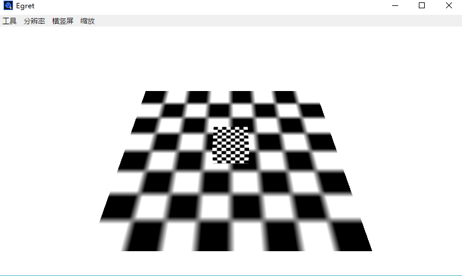

		3）控制相机运动，这里我们书写一个简单相机移动控制器。
			a) 示例代码：

				class Main extends egret.DisplayObject {
				
				
				    // Canvas操作对象
				    protected _egret3DCanvas: egret3d.Egret3DCanvas;
				    // View3D操作对象
				    protected _view3D: egret3d.View3D;
				    // 当前的相机对象
				    protected _camera: egret3d.Camera3D;
				    // 当前按键状态
				    protected _key: number;
				
				    public constructor() {
				        super();
				        //创建Canvas对象。
				        this._egret3DCanvas = new egret3d.Egret3DCanvas();
				        //Canvas的起始坐标，页面左上角为起始坐标(0,0)。
				        this._egret3DCanvas.x = 0;
				        this._egret3DCanvas.y = 0;
				        //设置Canvas页面尺寸。
				        this._egret3DCanvas.width = window.innerWidth;
				        this._egret3DCanvas.height = window.innerHeight;
				
				        //创建View3D对象,页面左上角为起始坐标(0,0)
				        this._view3D = new egret3d.View3D(0, 0, window.innerWidth, window.innerHeight);
				        //当前对象对视位置,其参数依次为:
				        //@param pos 对象的位置
				        //@param target 目标的位置
				        this._view3D.camera3D.lookAt(new egret3d.Vector3D(0, 500, 500), new egret3d.Vector3D(0, 0, 0));
				        //View3D的背景色设置
				        this._view3D.backColor = 0xffffff;
				        //将View3D添加进Canvas中
				        this._egret3DCanvas.addView3D(this._view3D);
				        //初始化当前相机
				        this._camera = this._view3D.camera3D;
				
				
				        //启动_egret3DCanvas
				        this._egret3DCanvas.start();
				
				
				        //创建立方体，放置于场景内(0,0,0)位置
				        //创建一个默认的贴图材质球
				        var mat_cube: egret3d.TextureMaterial = new egret3d.TextureMaterial();
				        //使用内置cube数据构造出一个默认参数cube
				        var geometery_Cube: egret3d.CubeGeometry = new egret3d.CubeGeometry();
				        //通过材质球和geometery数据创建一个mesh对象
				        var cube = new egret3d.Mesh(geometery_Cube, mat_cube);
				        //将mesh节点添加到View3D内
				        this._view3D.addChild3D(cube);
				
				
				        ///创建面片，放置于场景内(0,0,0)位置
				        ///创建一个默认的贴图材质球
				        var mat_Plane: egret3d.TextureMaterial = new egret3d.TextureMaterial();
				        //使用内置Plane数据构造出一个默认参数Plane
				        var geometery_Plane: egret3d.PlaneGeometry = new egret3d.PlaneGeometry();
				        //通过材质球和geometery数据创建一个mesh对象
				        var plane = new egret3d.Mesh(geometery_Plane, mat_Plane);
				        //将mesh节点添加到View3D内
				        this._view3D.addChild3D(plane);
				
				        ///设置默认值-1
				        this._key = -1;
				
				        ///注册事件，持有对象为_egret3DCanvas，每帧触发该注册方法，需要依次写入事件标识符，注册方法和注册对象。
				        this._egret3DCanvas.addEventListener(egret3d.Event3D.ENTER_FRAME, this.OnUpdate, this);
				        ///注册鼠标按下事件
				        egret3d.Input.addEventListener(egret3d.KeyEvent3D.KEY_DOWN, this.OnKeyDown, this);
				        ///注册鼠标回弹事件
				        egret3d.Input.addEventListener(egret3d.KeyEvent3D.KEY_UP, this.OnKeyUp, this);
				
				
				        console.log("Hello World,Hello Egret3D");
				
				    }
				    //鼠标回弹事件
				    public OnKeyUp(e: egret3d.KeyEvent3D) {
				        //重置按键信息
				        this._key = -1;
				    }
				    //鼠标按下事件
				    public OnKeyDown(e: egret3d.KeyEvent3D) {
				        //记录按键信息
				        this._key = e.keyCode;
				    }
				
				    ///注册后，该事件将每帧响应
				    public OnUpdate(e: egret3d.Event3D) {
				        if (!this._camera || this._key == -1) {
				            return;
				        }
				        //qw控制上下 wasd控制前后左右
				        switch (this._key) {
				            case egret3d.KeyCode.Key_Q:
				                this._camera.y += 1;
				                break;
				            case egret3d.KeyCode.Key_E:
				                this._camera.y += -1;
				                break;
				            case egret3d.KeyCode.Key_W:
				                this._camera.z += -1;
				
				                break;
				            case egret3d.KeyCode.Key_S:
				                this._camera.z += 1;
				                break;
				            case egret3d.KeyCode.Key_A:
				                this._camera.x += 1;
				                break;
				            case egret3d.KeyCode.Key_D:
				
				                this._camera.x += -1;
				                break;
				        }
				
				    }
				}

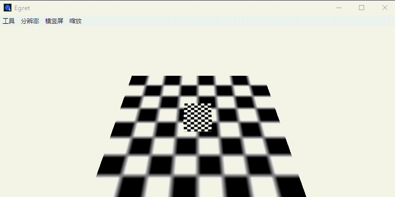

		3）添加灯光。这里我们添加一个红色灯光来看下效果。
			a) 示例代码：

			class Main extends egret.DisplayObject {
			
			
			    // Canvas操作对象
			    protected _egret3DCanvas: egret3d.Egret3DCanvas;
			    // View3D操作对象
			    protected _view3D: egret3d.View3D;
			    // 当前的相机对象
			    protected _camera: egret3d.Camera3D;
			    // 当前按键状态
			    protected _key: number;
			
			    public constructor() {
			        super();
			        //创建Canvas对象。
			        this._egret3DCanvas = new egret3d.Egret3DCanvas();
			        //Canvas的起始坐标，页面左上角为起始坐标(0,0)。
			        this._egret3DCanvas.x = 0;
			        this._egret3DCanvas.y = 0;
			        //设置Canvas页面尺寸。
			        this._egret3DCanvas.width = window.innerWidth;
			        this._egret3DCanvas.height = window.innerHeight;
			
			        //创建View3D对象,页面左上角为起始坐标(0,0)
			        this._view3D = new egret3d.View3D(0, 0, window.innerWidth, window.innerHeight);
			        //当前对象对视位置,其参数依次为:
			        //@param pos 对象的位置
			        //@param target 目标的位置
			        this._view3D.camera3D.lookAt(new egret3d.Vector3D(0, 500, 500), new egret3d.Vector3D(0, 0, 0));
			        //View3D的背景色设置
			        this._view3D.backColor = 0xffffff;
			        //将View3D添加进Canvas中
			        this._egret3DCanvas.addView3D(this._view3D);
			        //初始化当前相机
			        this._camera = this._view3D.camera3D;
			
			
			        //启动_egret3DCanvas
			        this._egret3DCanvas.start();
			
			
			        //创建立方体，放置于场景内(0,0,0)位置
			        //创建一个默认的贴图材质球
			        var mat_cube: egret3d.TextureMaterial = new egret3d.TextureMaterial();
			        //使用内置cube数据构造出一个默认参数cube
			        var geometery_Cube: egret3d.CubeGeometry = new egret3d.CubeGeometry();
			        //通过材质球和geometery数据创建一个mesh对象
			        var cube = new egret3d.Mesh(geometery_Cube, mat_cube);
			        //将mesh节点添加到View3D内
			        this._view3D.addChild3D(cube);
			
			
			        ///创建面片，放置于场景内(0,0,0)位置
			        ///创建一个默认的贴图材质球
			        var mat_Plane: egret3d.TextureMaterial = new egret3d.TextureMaterial();
			        //使用内置Plane数据构造出一个默认参数Plane
			        var geometery_Plane: egret3d.PlaneGeometry = new egret3d.PlaneGeometry();
			        //通过材质球和geometery数据创建一个mesh对象
			        var plane = new egret3d.Mesh(geometery_Plane, mat_Plane);
			        //将mesh节点添加到View3D内
			        this._view3D.addChild3D(plane);
			
			        ///设置默认值-1
			        this._key = -1;
			
			        ///注册事件，持有对象为_egret3DCanvas，每帧触发该注册方法，需要依次写入事件标识符，注册方法和注册对象。
			        this._egret3DCanvas.addEventListener(egret3d.Event3D.ENTER_FRAME, this.OnUpdate, this);
			        ///注册鼠标按下事件
			        egret3d.Input.addEventListener(egret3d.KeyEvent3D.KEY_DOWN, this.OnKeyDown, this);
			        ///注册鼠标回弹事件
			        egret3d.Input.addEventListener(egret3d.KeyEvent3D.KEY_UP, this.OnKeyUp, this);
			
			
			
			        
			    	///创建一个灯光组，该灯光组将管理场景内的灯光资源
			        var lights: egret3d.LightGroup = new egret3d.LightGroup();
			        ///创建一个方向光对象，其中参数(-0.5, -0.6, 0.2)为方向向量，为灯光方向，默认方向为0, 0, 1)。
			        var dirLight: egret3d.DirectLight = new egret3d.DirectLight(new egret3d.Vector3D(-0.5, -0.6, 0.2));
			        ///灯光漫反射颜色是红色，默认为白色
			        dirLight.diffuse = 0xff0000;
			        ///写入组
			        lights.addLight(dirLight);
			        ///设置灯效组。
			        cube.material.lightGroup = lights;
			        plane.material.lightGroup = lights;
			
			        console.log("Hello World,Hello Egret3D");
			
			    }
			    //鼠标回弹事件
			    public OnKeyUp(e: egret3d.KeyEvent3D) {
			        //重置按键信息
			        this._key = -1;
			    }
			    //鼠标按下事件
			    public OnKeyDown(e: egret3d.KeyEvent3D) {
			        //记录按键信息
			        this._key = e.keyCode;
			    }
			
			    ///注册后，该事件将每帧响应
			    public OnUpdate(e: egret3d.Event3D) {
			        if (!this._camera || this._key == -1) {
			            return;
			        }
			        //qw控制上下 wasd控制前后左右
			        switch (this._key) {
			            case egret3d.KeyCode.Key_Q:
			                this._camera.y += 1;
			                break;
			            case egret3d.KeyCode.Key_E:
			                this._camera.y += -1;
			                break;
			            case egret3d.KeyCode.Key_W:
			                this._camera.z += -1;
			
			                break;
			            case egret3d.KeyCode.Key_S:
			                this._camera.z += 1;
			                break;
			            case egret3d.KeyCode.Key_A:
			                this._camera.x += 1;
			                break;
			            case egret3d.KeyCode.Key_D:
			
			                this._camera.x += -1;
			                break;
			        }
			
			    }
			}

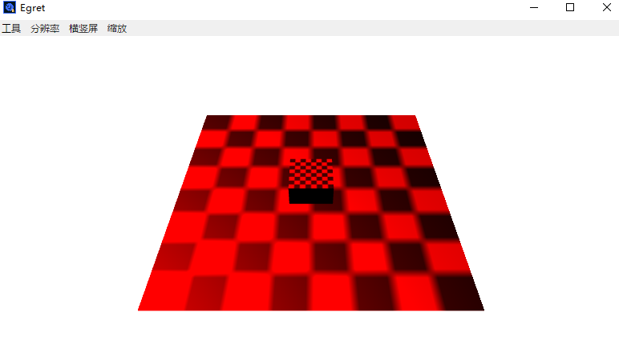