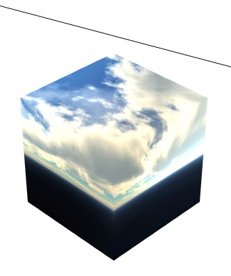
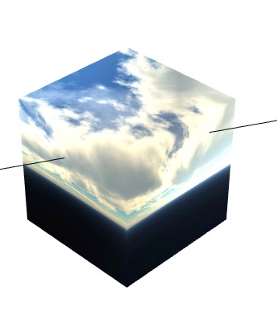

# 3D 碰撞

### 射线与模型碰撞

##### 原理：检测一条射线是否穿透一个模型。

* 未碰撞：

	

* 碰撞：

	


##### api（egret3d.Bound）:

* 射线与模型具体数据相交

~~~ 	
IntersectMesh ( verticesData :Array, indexData :Array, offset :number, faces :number, uv_offset :number, mMat :egret3d.Matrix4_4, result :egret3d.PickResult ):boolean
~~~

	* verticesData:Array — 检测的模型的顶点数据
	* indexData:Array — 检测的模型的索引数据
	* offset:number — 每个顶点的大小
	* faces:number — 模型面数
	* uv_offset:number — 模型顶点中UV的偏移
	* mMat:egret3d.Matrix4_4 — 顶点的世界变换矩阵
	* result:egret3d.PickResult — 相交相关数据


* 射线与模型对象相交

~~~
IntersectMeshEx ( renderItem :egret3d.IRender, uv_offset :number, result :egret3d.PickResult ):boolean
~~~

	* renderItem:egret3d.IRender — 检测的模型
	* uv_offset:number — 模型顶点中UV的偏移
	* result:egret3d.PickResult — 相交相关数据


* 射线与三角形相交

~~~ 	
IntersectTriangle ( v0 :egret3d.Vector3D, v1 :egret3d.Vector3D, v2 :egret3d.Vector3D, ret :Array ):boolean
~~~

	* v0:egret3d.Vector3D — 三角形的第一个顶点
	* v1:egret3d.Vector3D — 三角形的第二个顶点
	* v2:egret3d.Vector3D — 三角形的第三个顶点
	* ret:Array — t(交点到射线起始点的距离) u(交点在v1-v0上的投影的位置) v(交点在v1-v2上的投影的位置, 交点为ret=v0+pU*(v1-v0)+pV*(v2-v0))


##### 示例：

```
var pickResult:egret3d.PickResult = new egret3d.PickResult();
var result:boolean = ray.IntersectMeshEx(cube, 1, pickResult);

```

```
* ray：射线
* cube：一个包围盒
* IntersectMeshEx：检测方法
* pickResult：相交相关数据
* result： 是否碰撞，true 碰撞，false 未碰撞

```

