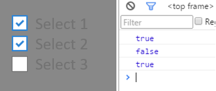

复选框组件 `eui.CheckBox` 继承自切换按钮 `eui.ToggleButton`。当它被选中,`selected`属性将变为true，反之则为false。

当然复选框按钮也继承自按钮 `eui.Button` 和容器 `eui.Component` ,他具有按钮和容器的基本功能。

``` TypeScript
var cbx = new eui.CheckBox();
cbx.label = "Select 1";
this.addChild(cbx);
cbx.addEventListener(
    eui.UIEvent.CHANGE,
    (evt:eui.UIEvent)=>{egret.log(evt.target.selected);
    },this
);

var cbx2 = new eui.CheckBox();
cbx2.label = "Select 2";
cbx2.y = 30;
this.addChild(cbx2);

var cbx3 = new eui.CheckBox();
cbx3.label = "Select 3";
cbx3.y = 60;
cbx3.enabled = false;//禁用复选框
this.addChild(cbx3);
```
得到的效果：



> 同前面一节一样，这里也使用：
```
egret create HelloEUI --type eui
```
> 创建示例项目的默认皮肤。可以在示例项目的`eui_skins`文件夹下找到默认皮肤的 exml 文件。