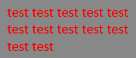
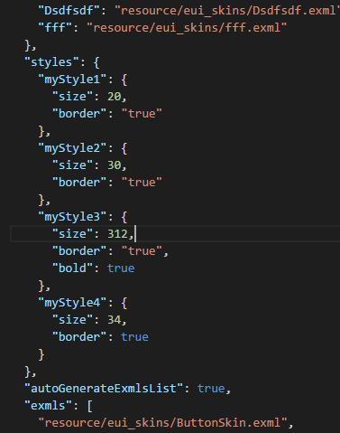

文本控件对应的类是 eui.Label。eui.Label 继承自 egret.TextField，实现了 eui.UIComponent 接口。因此它不仅拥有基本的文本功能(egret.TextField)，还有自动布局功能(eui.UIComponent)。

基本的文本使用请参考 [Egret Engine - 处理文本](../../../../Engine2D/textField/createText/README.md)

使用方式也非常简单，比如下面的例子：
```  TypeScript
var label:eui.Label = new eui.Label();
label.text = "eui Label 测试";
this.addChild(label);
```
得到的效果：


上面这是设置了它的显示文字，您还可以修改样式，实现不同的显示效果：

```  TypeScript
label.width = 400;//设置宽度
label.height = 300;//设置高度
label.fontFamily = "Tahoma";//设置字体
label.textColor = 0xFF0000;//设置颜色
label.size = 35;//设置文本字号
label.bold = true;//设置是否加粗
label.italic = true;//设置是否斜体
label.textAlign = "right";//设置水平对齐方式
label.verticalAlign = "middle";//设置垂直对齐方式
```
得到的效果：


Label既可以显示单行文本，也可以显示多行文本。当您为Label设定了宽度，并且文字过长的时候，会自动换行。
```  TypeScript
label.width = 200;
label.height = 60;
label.size = 14;
label.lineSpacing = 2;//行间距
label.text = "很多的文字很多的文字很多的文字很多的文字很多的文字很多的文字";
```
得到的效果：



###style属性(3.2.1 以上支持)
在引擎eui 3.2.1 版本后，label增加了style属性的支持，有点像css的样式。
在default.thm.json中增加style的设置



在exml中给label设置style样式


最终显示的效果：


