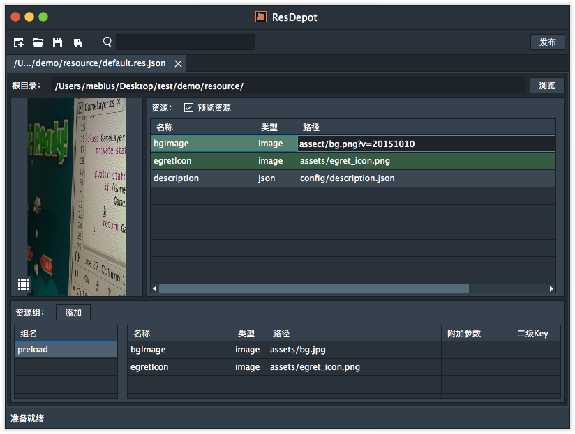

本文涉及到 WEB 与 Native 两种版本控制。

本文的调试环境为引擎 3.0.0

### WEB版本控制

default.res.json 中 resources 节点下配置的每个资源加载项，在第一次加载成功时会用 name 属性作为 key 在内存缓存下来。

再次请求时，直接从内存缓存里取。如果有两个组都含有一个资源，第二个组再加载这个资源时，也会直接从缓存里得到结果，不会重复发起加载请求。

目前移动设备由于碎片化的问题，对于如 PC 端浏览器的本地临时文件缓存机制，还不是很完整，支持的非常有限。当我们再次进入游戏，资源还是会从服务器重新加载。

在设置配置文件加载项时，最常见的控制缓存机制是在URL后，加入特定字符，如:

    assect/bg.png?v=20151010

这样我们每次修改`v=xxxx`就是一个新的地址，保持地址不重复，就不会缓存。这样就可以合理的安排更新特定资源了。

通过 RES Deopt 打开资源配置文件，双击需要设置的配置项，就可以进行编辑设置，如图：

> 由于此中方式在 Native 下不可使用，因此建议在发布 Web 版本时在发布的配置文件里加上版本。

### Native版本控制

native涉及到[热更新机制](../../../Engine2D/native/hotUpdate/README.md)，由于热更新机制每次资源更新后，会产生一个临时的本地命名，所以 RES 模块提供了两个方法用户处理版本控制。

正常情况下，代码一般放置于 onAddToStage 方法中：

    private onAddToStage(event:egret.Event) {
        //设置加载进度界面
        //Config to load process interface
        this.loadingView = new LoadingUI();
        this.stage.addChild(this.loadingView);

        //初始化Resource资源加载库
        //initiate Resource loading library
        RES.addEventListener(RES.ResourceEvent.CONFIG_COMPLETE, this.onConfigComplete, this);
        RES.loadConfig("resource/default.res.json", "resource/");
    }

#### getChangeList

getChangeList 方法用于获取本次热更新后，新增或改变（文件名相同，但更改过的文件）的资源列表，在Web端此列表为空。返回数组形式，如： `[{url:"a.png", size:888}]`

        var array: any[] = RES.getVersionController().getChangeList();
        if(array.length > 0) {
            this.versionText = array[0].url + "|" + array[0].size;
        }

array[0].url 表示资源的新路径，我们每次热更新中，资源文件夹中新的资源路径地址。
array[0].size 文件的大小。

#### getVirtualUrl

getVirtualUrl 获取资源文件实际的URL地址。由于热更新版本控制实际已经对原来的资源文件的URL进行了改变，因此想获取指定资源文件实际的URL时需要调用此方法。

假设我们修改了 `resource/assets/bg.jpg` 通过热更新后，实际的地址为  `resource/9b/9be1d82b_138755.jpg`。 现在想获取实际地址就可以通过 getVirtualUrl 方法。如下：

	console.log(RES.getVersionController().getVirtualUrl("resource/assets/bg.jpg"));

输出结果为：

	resource/9b/9be1d82b_138755.jpg

> 注： getChangeList 与 getVirtualUrl 方法的调用，需在` RES.loadConfig("resource/default.res.json", "resource/")` 加载完成后。
> 如果代码里使用非 RES 模块的加载比如 ImageLoader 等，请使用 `RES.getVersionController().getVirtualUrl()`转换 url 后再传给 ImageLoader 等使用。