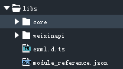
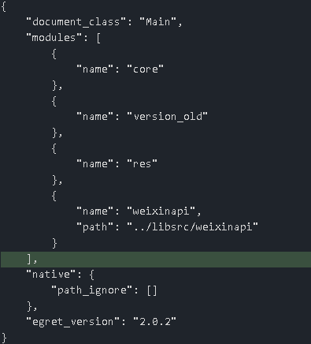

## 一、配置JSSDK第三方库 

1、下载或更新第三方库 [第三方库github地址点此进入](https://github.com/egret-labs/egret-game-library)


2、在项目中设置微信第三方库

参考：[第三方库的使用方法](../../../extension/threes/instructions/)

2.1 将下载好的weixinapi文件放置在项目外的任意文件夹内。例如，新建一个testWeixin的egret项目，将weixinapi放置在其外的libsrc文件夹内，例如：

```
C:\wamp\www\egret\libsrc\weixinapi
```


项目文件夹如下:

```
C:\wamp\www\egret\testWeixin
```


2.2 配置项目内文件

进入到 Egret 项目内，(如何新建 Egret项目详见：[Get Started](../../../Engine2D/getStarted/getStarted/)  或通过 egret wing 文件-- 新建egret 项目)。



找到egretProperties.json 文件，添加weixinapi模块。例如wenxinapi 文件放在以上libsrc文件夹下，通过如下方式添加模块:



其中

```
{
    "name": "weixinapi",
    "path": "../libsrc/weixinapi"
}
```

path 表示微信模块文件的目录.

添加好上述代码后，执行 `egret build -e -clean` (编译引擎) 就会把模块编译到项目中，并在代码中使用该第三方库。

2.3  验证引入文件是否成功

在 egret 项目中添加如下代码


```
var bodyConfig: BodyConfig = new BodyConfig();
bodyConfig.appId = "此处填写公共平台appID，未认证的ID将不能使用自定义分享等接口，请联系微信官方获取";
bodyConfig.debug = true;
/// ... 其他的配置属性赋值
/// 通过config接口注入权限验证配置
if(wx) {
      wx.config(bodyConfig);
      wx.ready(function() {
      /// 在这里调用微信相关功能的 API
       });
}
```

编译成功后，打开浏览器控制台，可以看到以下输出：


## 二、微信JSSDK 的使用

参考：微信JS-SDK说明文档

[微信JS-SDK说明文档](http://mp.weixin.qq.com/wiki/7/aaa137b55fb2e0456bf8dd9148dd613f.html#JSSDK.E4.BD.BF.E7.94.A8.E6.AD.A5.E9.AA.A4)

* 步骤一：绑定域名 

先登录微信公众平台进入“公众号设置”的“功能设置”里填写“JS接口安全域名”。 

备注：登录后可在“开发者中心”查看对应的接口权限。

 
* 步骤二：引入JS文件 

详见上一章，“配置JSSDK第三方库”
 
* 步骤三：通过config接口注入权限验证配置

所有需要使用JS-SDK的页面必须先注入配置信息，否则将无法调用（同一个url仅需调用一次，对于变化url的SPA的web app可在每次url变化时进行调用,目前Android微信客户端不支持pushState的H5新特性，所以使用pushState来实现web app的页面会导致签名失败，此问题会在Android6.2中修复）。

注：这里需要通过后台脚本获得动态签名和时间戳等，这里可以参考开发者提供的教程配置后台脚本。 

开发者提供的教程：[d8q8提供的教程地址](http://bbs.egret-labs.org/forum.php?mod=viewthread&tid=3279)

开发者提供的代码下载： [d8q8提供的源码下载](http://bbs.egret-labs.org/forum.php?mod=viewthread&tid=6411)

                    [php新接口更新](http://bbs.egret.com/forum.php?mod=viewthread&tid=10639) 

此处感谢 [开发者论坛](http://bbs.egret-labs.org/forum.php?mod=viewthread&tid=3279) d8q8 同志提供教程。

配置好后台脚本后，这里参考 d8q8 上面给出的源码，定义接口：

```
interface SignPackage {
    appId:string;
    nonceStr:string;
    timestamp:number;
    signature:string;
    url:string;
}
```

获取数据：

```
private url:string; 
private signPackage:SignPackage;
    /**
     * 获取签名分享
     */
 private getSignPackage() {
        var urlloader = new egret.URLLoader();
        var req = new egret.URLRequest(this.url);
        urlloader.load(req);
        req.method = egret.URLRequestMethod.GET;
        urlloader.addEventListener(egret.Event.COMPLETE, (e)=> {
            this.signPackage = <SignPackage>JSON.parse(e.target.data);
            this.getWeiXinConfig();//下面会定义
        }, this);
}
```

这里使用以上开发者 d8q8 教程中规定的json数据格式，具体如下: 

* 公众号的唯一标识:  appId 

* 时间戳: timestamp  

* 随机码: nonceStr  

* 签名: signature

```
private getWeiXinConfig() {
        /*
         * 注意：
         * 1. 所有的JS接口只能在公众号绑定的域名下调用，公众号开发者需要先登录微信公众平台进入“公众号设置”的“功能设置”里填写“JS接口安全域名”。
         * 2. 如果发现在 Android 不能分享自定义内容，请到官网下载最新的包覆盖安装，Android 自定义分享接口需升级至 6.0.2.58 版本及以上。
         * 3. 完整 JS-SDK 文档地址：http://mp.weixin.qq.com/wiki/7/aaa137b55fb2e0456bf8dd9148dd613f.html
         *
         * 如有问题请通过以下渠道反馈：
         * 邮箱地址：weixin-open@qq.com
         * 邮件主题：【微信JS-SDK反馈】具体问题
         * 邮件内容说明：用简明的语言描述问题所在，并交代清楚遇到该问题的场景，可附上截屏图片，微信团队会尽快处理你的反馈。
         */
        //配置参数
        var bodyConfig = new BodyConfig();
        bodyConfig.debug = true;// 开启调试模式,调用的所有api的返回值会在客户端alert出来，若要查看传入的参数，可以在pc端打开，参数信息会通过log打出，仅在pc端时才会打印。
        bodyConfig.appId = this.signPackage.appId;// 必填，公众号的唯一标识
        bodyConfig.timestamp = this.signPackage.timestamp;// 必填，生成签名的时间戳
        bodyConfig.nonceStr = this.signPackage.nonceStr;// 必填，生成签名的随机串
        bodyConfig.signature = this.signPackage.signature;// 必填，签名，见附录1
        bodyConfig.jsApiList = [// 必填，需要使用的JS接口列表
                              // 所有要调用的 API 都要加到这个列表中
                              'checkJsApi',//判断当前客户端是否支持指定JS接口
                              'chooseImage'//拍照或从手机相册中选图接口
        ];
        wx.config(bodyConfig);
}
```

步骤四：通过ready接口处理成功验证

```
wx.ready(function() {
     /// 在这里调用微信相关功能的 API
     wx.checkJsApi({
       jsApiList: ['chooseImage'], // 需要检测的JS接口列表，所有JS接口列表见附录2,
       success: function(res) {
        // 以键值对的形式返回，可用的api值true，不可用为false
       // 如：{"checkResult":{"chooseImage":true},"errMsg":"checkJsApi:ok"}
       }
      });
});
```

备注：checkJsApi接口是客户端6.0.2新引入的一个预留接口，第一期开放的接口均可不使用checkJsApi来检测。

## 三、具体接口的使用举例 

实例参考来源: [微信JSSDK 实例参考来源](http://mp.weixin.qq.com/wiki/7/aaa137b55fb2e0456bf8dd9148dd613f.html#.E6.AD.A5.E9.AA.A4.E5.9B.9B.EF.BC.9A.E9.80.9A.E8.BF.87ready.E6.8E.A5.E5.8F.A3.E5.A4.84.E7.90.86.E6.88.90.E5.8A.9F.E9.AA.8C.E8.AF.81)

1.微信分享接口

注：微信公共平台需要认证才能使用分享接口，详情咨询微信官方。 

1.1  获取“分享给朋友”按钮点击状态及自定义分享内容接口.

```
private onShareAPPMessage() { 
            var shareAppMessage = new BodyMenuShareAppMessage();
            shareAppMessage.title = '发送给朋友';
            shareAppMessage.desc = '在长大的过程中，我才慢慢发现，我身边的所有事，别人跟我说的所有事，那些所谓本来如此，注定如此的事，它们其实没有非得如此，事情是可以改变的。更重要的是，有些事既然错了，那就该做出改变。';
            shareAppMessage.link = 'http://movie.douban.com/subject/25785114/';
            shareAppMessage.imgUrl = 'http://demo.open.weixin.qq.com/jssdk/images/p2166127561.jpg';
            
            shareAppMessage.trigger = function (res) {
                // 不要尝试在trigger中使用ajax异步请求修改本次分享的内容，因为客户端分享操作是一个同步操作，这时候使用ajax的回包会还没有返回
                console.log('用户点击发送给朋友');
            }    
            shareAppMessage.success = function (res) {
                console.log('已分享');
            };
            shareAppMessage.fail = function (res) {
                console.log('已取消');
            };
            shareAppMessage.cancel = function (res) {
                console.log(JSON.stringify(res));
            };   
        }
```

1.2 获取“分享到QQ”按钮点击状态及自定义分享内容接口


```
 private onShareQQ() { 
        var shareqq = new BodyMenuShareQQ();
        shareqq.title = "分享到QQ";
        shareqq.desc = "在长大的过程中，我才慢慢发现，我身边的所有事，别人跟我说的所有事，那些所谓本来如此，注定如此的事，它们其实没有非得如此，事情是可以改变的。更重要的是，有些事既然错了，那就该做出改变。";
        shareqq.link = "http://movie.douban.com/subject/25785114/";
        shareqq.imgUrl = "http://img3.douban.com/view/movie_poster_cover/spst/public/p2166127561.jpg";
        shareqq.complete = function (res) {
            console.log(JSON.stringify(res));
        };
        shareqq.trigger = function (res) {
            console.log('用户点击分享到QQ');
        };
        shareqq.success = function (res) {
            console.log('已分享');
        };
        shareqq.cancel = function (res) {
            console.log('已取消');
        };
        shareqq.fail = function (res) {
            console.log(JSON.stringify(res));
        };    
    }
```

1.3 监听“分享到微博”按钮点击、自定义分享内容及分享结果接口

```
private onshareWeibo(e:egret.TouchEvent) { 
        var shareweibo = new BodyMenuShareWeibo();
        shareweibo.title = "用户点击分享到微博";
        shareweibo.desc = "在长大的过程中，我才慢慢发现，我身边的所有事，别人跟我说的所有事，那些所谓本来如此，注定如此的事，它们其实没有非得如此，事情是可以改变的。更重要的是，有些事既然错了，那就该做出改变。";
        shareweibo.link = "http://movie.douban.com/subject/25785114/";
        shareweibo.imgUrl = "http://img3.douban.com/view/movie_poster_cover/spst/public/p2166127561.jpg";
        shareweibo.complete = function (res) {
            console.log(JSON.stringify(res));
        };
        shareweibo.trigger = function (res) {
            console.log('用户点击分享到微博');
        };
        shareweibo.cancel = function (res) {
            console.log('已取消');
        };
        shareweibo.fail = function (res) {
            console.log(JSON.stringify(res));
        };
    }
```

1.4 监听“分享到朋友圈”按钮点击、自定义分享内容及分享结果接口

```
private onTimeline(e:egret.TouchEvent): void { 
        var sharet = new BodyMenuShareTimeline();
        sharet.title = "用户点击分享到朋友圈";
        sharet.link = "http://movie.douban.com/subject/25785114/";
        sharet.imgUrl = "http://demo.open.weixin.qq.com/jssdk/images/p2166127561.jpg";
        sharet.trigger = function (res) {
            // 不要尝试在trigger中使用ajax异步请求修改本次分享的内容，因为客户端分享操作是一个同步操作，这时候使用ajax的回包会还没有返回
            console.log('用户点击分享到朋友圈');
        };
        sharet.success = function (res) {
            console.log('已分享');
        };
        sharet.cancel = function (res) {
            console.log('已取消');
        };
        sharet.fail = function (res) {
            console.log(JSON.stringify(res));
        };    
    }
```